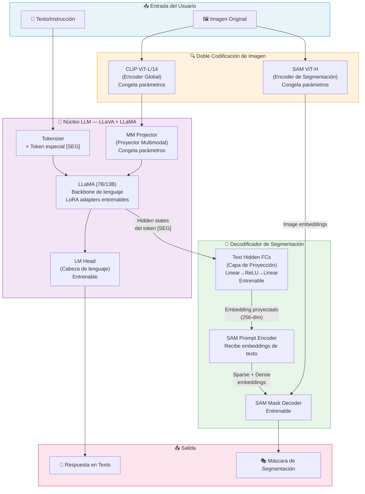
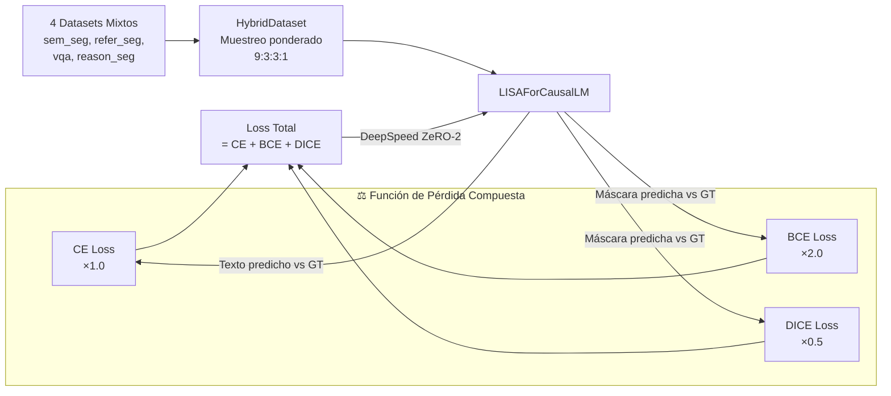
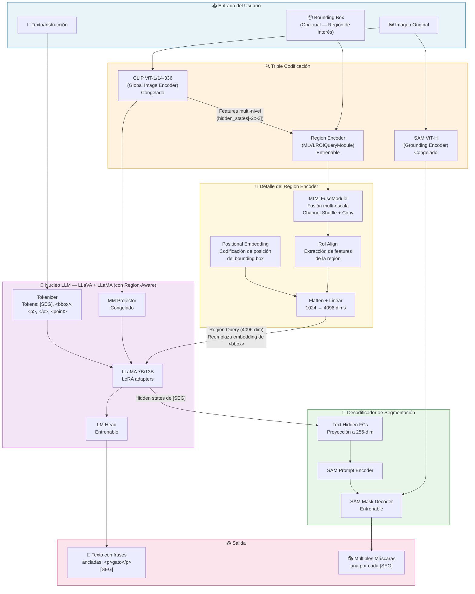
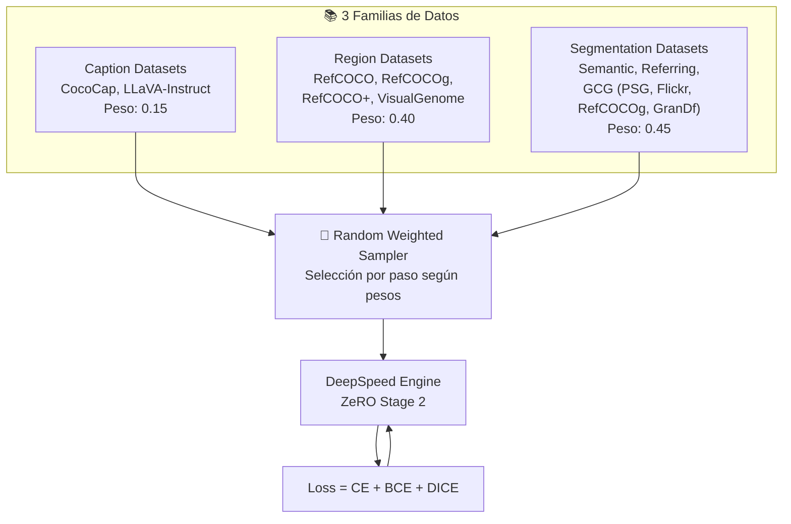
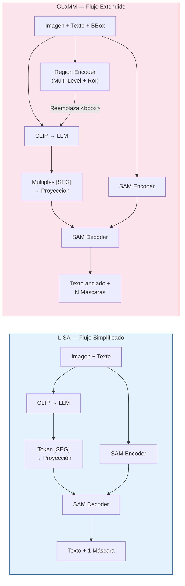

# Análisis Arquitectónico: LISA y GLaMM

Análisis detallado de los dos repositorios de segmentación multimodal basados en LLM presentes en la carpeta `MedGemma Segmentation`.

---

## 1. LISA — Large Language Instructed Segmentation Assistant

### 1.1 Explicación Global

LISA es un sistema que combina un **Modelo de Lenguaje Grande Multimodal** (LLM, por sus siglas en inglés — un modelo de inteligencia artificial capaz de entender texto e imágenes simultáneamente) con un **modelo de segmentación de imágenes** (SAM — Segment Anything Model, un modelo de Meta capaz de "recortar" objetos en imágenes).

**¿Qué hace LISA?** Recibe una imagen y una pregunta/instrucción en texto natural (por ejemplo: *"¿Quién es el presidente en esta imagen? Por favor genera una máscara de segmentación"*), y produce dos cosas:
1. Una **respuesta en texto** explicando su razonamiento.
2. Una **máscara de segmentación** (una imagen binaria que delimita exactamente el objeto identificado).

La innovación clave es que LISA puede realizar **"reasoning segmentation"** (segmentación por razonamiento): entiende instrucciones implícitas y complejas que requieren conocimiento del mundo real, no solo referencias directas como "segmenta el gato rojo".

### 1.2 Diagrama de Arquitectura

### 1.3 Diagrama del Flujo de Datos (Entrenamiento)

### 1.4 Explicación Detallada de Componentes

#### A. Codificadores de Imagen (Image Encoders) — Doble Pipeline

LISA utiliza **dos encoders de imagen separados** que procesan la misma imagen de formas distintas:

| Componente | Modelo | Resolución | Función | ¿Se entrena? |
|---|---|---|---|---|
| **Global Encoder** | CLIP ViT-L/14 | 224×224 | Extrae features semánticas globales para que el LLM "entienda" la imagen | ❌ Congelado |
| **Grounding Encoder** | SAM ViT-H | 1024×1024 | Extrae features espaciales de alta resolución para generar máscaras precisas | ❌ Congelado |

- **CLIP** ([Contrastive Language-Image Pre-training](file:///g:/My%20Drive/Experiments/MedGemma%20Segmentation/LISA/model/llava)): Codifica la imagen en un espacio compartido con el texto. Sus features pasan por el `MM Projector` para alinearlas con la dimensión del LLM.
- **SAM Image Encoder**: Codifica la imagen a alta resolución. Su salida se usa **solo** en el decodificador de máscaras, no pasa por el LLM.

#### B. LLM Core — LLaVA + LLaMA

- **Tokenizer**: Procesa el texto y agrega un token especial `[SEG]` al vocabulario. Este token actúa como una "señal" que le dice al sistema: *"aquí debe generarse una máscara de segmentación"*.
- **LLaMA** (7B o 13B parámetros): El modelo de lenguaje base. Se entrena con **LoRA** (Low-Rank Adaptation — una técnica que agrega pequeñas matrices entrenables a las capas `q_proj` y `v_proj` del transformer, sin modificar los pesos originales). Esto reduce drásticamente la memoria necesaria.
- **MM Projector**: Un MLP (red neuronal de 2 capas) que transforma los features de CLIP al espacio de dimensiones del LLM. Está **congelado** durante el entrenamiento.

#### C. Decodificador de Segmentación

- **Text Hidden FCs** ([LISA.py L89-101](file:///g:/My%20Drive/Experiments/MedGemma%20Segmentation/LISA/model/LISA.py#L89-L101)): Una red `Linear(4096→4096) → ReLU → Linear(4096→256)` que proyecta el hidden state del token `[SEG]` a un embedding de 256 dimensiones compatible con SAM.
- **SAM Prompt Encoder**: Toma el embedding proyectado y lo convierte en "sparse embeddings" (prompts de texto para SAM) y "dense embeddings".
- **SAM Mask Decoder**: Combina los image embeddings del SAM Encoder con los prompts del Prompt Encoder para generar la máscara final. Este componente **sí se entrena**.

#### D. Función de Pérdida

La pérdida total combina tres componentes ([LISA.py L305-335](file:///g:/My%20Drive/Experiments/MedGemma%20Segmentation/LISA/model/LISA.py#L305-L335)):

- **Cross-Entropy Loss** (peso 1.0): Mide qué tan bien el LLM genera el texto correcto.
- **Binary Cross-Entropy Loss** (peso 2.0): Compara pixel a pixel la máscara predicha vs. la real.
- **DICE Loss** (peso 0.5): Mide el solapamiento global entre la máscara predicha y la real (similar a IoU — Intersection over Union).

#### E. Pipeline de Entrenamiento

Definido en [train_ds.py](file:///g:/My%20Drive/Experiments/MedGemma%20Segmentation/LISA/train_ds.py):
- Usa **DeepSpeed ZeRO Stage 2** para entrenamiento distribuido eficiente.
- Combina 4 tipos de datos con muestreo ponderado (9:3:3:1): segmentación semántica, segmentación referencial, VQA, y segmentación por razonamiento.
- Validación con métricas **gIoU** (global Intersection over Union) y **cIoU** (class IoU).

#### F. Pipeline de Inferencia

Definido en [chat.py](file:///g:/My%20Drive/Experiments/MedGemma%20Segmentation/LISA/chat.py): un loop interactivo donde el usuario ingresa texto + ruta de imagen, y el modelo genera texto + máscara.

---

## 2. GLaMM — Grounding Large Multimodal Model

### 2.1 Explicación Global

GLaMM es una evolución más ambiciosa del concepto de LISA. Mientras que LISA solo procesa instrucciones a nivel de imagen completa, GLaMM introduce **comprensión a nivel de región**: el usuario puede señalar una zona específica de la imagen (con un bounding box — un rectángulo delimitador) y preguntar sobre ella.

**¿Qué hace GLaMM?** Introduce una tarea nueva llamada **Grounded Conversation Generation (GCG)**: generar texto conversacional donde cada frase relevante está "anclada" a una máscara de segmentación específica. Es decir, el modelo no solo dice "hay un perro", sino que produce `
perro
[SEG]` donde `[SEG]` se convierte en una máscara que muestra exactamente dónde está el perro.

GLaMM tiene **tres encoders** en vez de dos, añadiendo un **Region Encoder** que permite procesar zonas específicas de la imagen.

### 2.2 Diagrama de Arquitectura

### 2.3 Diagrama del Flujo de Entrenamiento (Multi-Dataset)

### 2.4 Explicación Detallada de Componentes

#### A. Triple Codificación de Imagen

GLaMM extiende la doble codificación de LISA con un tercer encoder:

| Componente | Modelo | Resolución | Función | ¿Se entrena? |
|---|---|---|---|---|
| **Global Encoder** | CLIP ViT-L/14-**336** | 336×336 | Features semánticas para el LLM (resolución mayor que LISA) | ❌ Congelado |
| **Grounding Encoder** | SAM ViT-H | 1024×1024 | Features espaciales para máscaras | ❌ Congelado |
| **Region Encoder** | MLVLROIQueryModule | Multi-escala | Extrae features de regiones específicas delimitadas por bounding boxes | ✅ Entrenable |

#### B. Region Encoder — El Diferenciador Clave

Este componente ([layers.py](file:///g:/My%20Drive/Experiments/MedGemma%20Segmentation/groundingLMM/model/layers.py)) es lo que distingue a GLaMM de LISA. Funciona así:

1. **MLVLFuseModule** (Multi-Level Fusion): Toma features de CLIP de múltiples capas ocultas (4 niveles), los redimensiona a escalas crecientes, agrega coordenadas espaciales, y realiza "channel shuffle" (mezcla de canales entre niveles vecinos) con convoluciones.
2. **RoI Align** (Region of Interest Alignment): Usa las coordenadas del bounding box para "recortar" las features fusionadas de la región de interés, produciendo un tensor de tamaño fijo (14×14) independiente del tamaño de la región.
3. **Positional Embedding**: Codifica las coordenadas (x1,y1,x2,y2) del bounding box en un embedding posicional de 1024 dimensiones.
4. **Flatten + Linear**: Aplana las features RoI, las proyecta a 1024 dims, suma el positional embedding, y finalmente proyecta a 4096 dims (la dimensión del LLM).

El resultado (un "Region Query") **reemplaza el embedding del token `<bbox>`** en la secuencia de entrada del LLM, inyectando información espacial de la región directamente en el flujo de atención del transformer.

#### C. Tokens Especiales Extendidos

GLaMM agrega más tokens especiales que LISA:

| Token | Función |
|---|---|
| `[SEG]` | Señal para generar una máscara de segmentación (igual que LISA) |
| `<bbox>` | Marcador que se reemplaza por el Region Query del encoder de regiones |
| `
` / `
` | Delimitadores de frase para GCG — marcan qué texto está "anclado" a un `[SEG]` |
| `<point>` | Marcador para prompts de punto (alternativa al bounding box) |

#### D. LLaVA con Region-Aware Architecture

El archivo [llava_with_region_arch.py](file:///g:/My%20Drive/Experiments/MedGemma%20Segmentation/groundingLMM/model/llava/llava_with_region_arch.py) modifica la preparación de embeddings de LLaVA para:

1. Extraer features multi-nivel de CLIP (`hidden_states[-2::-3]` — cada 3 capas empezando desde la penúltima).
2. Pasarlos por el `Region Encoder` junto con los bounding boxes.
3. Reemplazar los embeddings de los tokens `<bbox>` con los Region Queries resultantes.

#### E. Entrenamiento Multi-Dataset con Muestreo Ponderado

Definido en [train.py](file:///g:/My%20Drive/Experiments/MedGemma%20Segmentation/groundingLMM/train.py):

- **3 familias de datos**: Caption (15%), Region (40%), Segmentation (45%).
- En cada paso de entrenamiento, se selecciona aleatoriamente una familia según sus pesos.
- Cada familia contiene múltiples sub-datasets con sus propias tasas de muestreo internas.
- **Módulos entrenables**: LoRA adapters, `lm_head`, `embed_tokens`, `mask_decoder`, `text_hidden_fcs`, y `region_encoder`.

#### F. GranD Dataset y Pipeline de Anotación

GLaMM incluye un directorio [GranD/](file:///g:/My%20Drive/Experiments/MedGemma%20Segmentation/groundingLMM/GranD) con un pipeline automatizado de anotación en 4 niveles:
1. **Level 1**: Inferencia inicial (detección + segmentación).
2. **Level 2**: Inferencia secundaria (refinamiento).
3. **Level 3**: Generación de captions densos.
4. **Level 4**: Contexto extra y enriquecimiento.

El dataset final, **GranD-f**, contiene ~214K pares imagen-texto anclado para fine-tuning de GCG.

#### G. Demo Interactiva

El archivo [app.py](file:///g:/My%20Drive/Experiments/MedGemma%20Segmentation/groundingLMM/app.py) implementa una interfaz Gradio que permite:
- Dibujar bounding boxes sobre la imagen.
- Hacer preguntas en lenguaje natural.
- Ver las máscaras generadas superpuestas.
- Generar nuevas imágenes con inpainting (SDXL) usando las máscaras como guía.

---

## 3. Tabla Comparativa: LISA vs GLaMM

| Aspecto | LISA | GLaMM |
|---|---|---|
| **Paper** | arXiv:2308.00692 (CVPR 2024 Oral) | arXiv:2311.03356 (CVPR 2024) |
| **Tarea principal** | Reasoning Segmentation | Grounded Conversation Generation (GCG) |
| **Número de encoders** | 2 (CLIP + SAM) | 3 (CLIP + SAM + Region Encoder) |
| **CLIP versión** | ViT-L/14 (224px) | ViT-L/14-**336** (336px) |
| **Entrada de región** | ❌ No soporta | ✅ Bounding boxes + puntos |
| **Token especial** | `[SEG]` | `[SEG]`, `<bbox>`, `
`/`
`, `<point>` |
| **Grounding de frases** | ❌ | ✅ Cada frase se ancla a una máscara |
| **Datasets de entrenamiento** | 4 tipos, 1 pipeline | 3 familias, ~10 sub-datasets |
| **Muestreo** | Ponderado fijo (9:3:3:1) | Selección aleatoria por peso por paso |
| **Dataset propio** | ReasonSeg (1218 imágenes) | GranD (7.5M conceptos, 810M regiones) |
| **Demo** | Gradio básica (texto + imagen) | Gradio avanzada (dibujar bbox + inpainting) |
| **Dependencias extra** | — | mmdet (MMDetection para RoI ops) |
| **Complejidad del modelo** | Menor (más sencillo de implementar) | Mayor (Region Encoder + multi-nivel) |

---

## 4. Diagrama Comparativo de Flujo

> [!IMPORTANT]
> **Relación entre ambos repos**: GLaMM reconoce explícitamente a LISA como una de sus bases. Comparten la misma filosofía fundamental (LLM + token `[SEG]` + SAM decoder), pero GLaMM la extiende con comprensión de regiones, anclaje de frases, y un dataset masivamente más grande.
