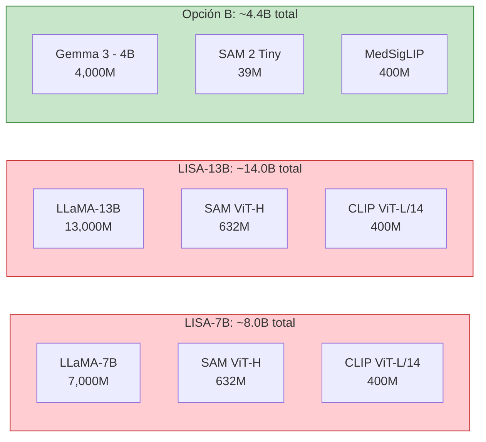
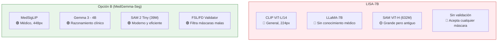

# Comparativa Técnica: LISA vs Opción B (MedGemma-Seg)

## 1. Comparativa de Eficiencia Computacional

### Tamaño Total del Modelo (Parámetros)

| Métrica | LISA-7B | LISA-13B | **Opción B** |
|---|---|---|---|
| **Parámetros totales** | ~8.0B | ~14.0B | **~4.4B** |
| **VRAM inferencia (bf16)** | ~18GB | ~30GB | **~10GB** |
| **VRAM inferencia (4-bit)** | ~9GB | ~16GB | **~5GB** |
| **VRAM entrenamiento (LoRA, bf16)** | ~24GB | ~40GB | **~16GB** |
| **GPU mínima (inferencia)** | A5000/3090 (24GB) | A100 (40GB) | **RTX 4070 (12GB)** |
| **GPU mínima (entrenamiento)** | A100 (40GB) | 2×A100 | **A5000/3090 (24GB)** |

> La Opción B es **~1.8× más eficiente** que LISA-7B y **~3.2× más eficiente** que LISA-13B en parámetros totales.

### Velocidad de Inferencia

| Componente | LISA-7B | **Opción B** | Razón |
|---|---|---|---|
| **Global Encoder** | CLIP: ~15ms | MedSigLIP: ~18ms | Resolución mayor (448 vs 224) |
| **LLM Generation** | LLaMA-7B: ~200ms/token | Gemma-4B: ~120ms/token | Gemma 3 más eficiente por token |
| **Grounding Encoder** | SAM ViT-H: ~150ms | SAM 2 Tiny: **~25ms** | **6× más rápido** |
| **Mask Decoder** | SAM: ~10ms | SAM 2: ~8ms | Similar |
| **FSL Validator** | ❌ No tiene | ~5ms | Overhead mínimo |
| **Total estimado** | **~375ms** | **~176ms** | **Opción B ~2.1× más rápida** |

### Entrenamiento

| Aspecto | LISA | **Opción B** |
|---|---|---|
| **LoRA target** | q_proj, v_proj del LLaMA | q_proj, v_proj del Gemma 3 |
| **Parámetros LoRA** | ~4.2M (r=8, 7B) | **~3.0M** (r=8, 4B) |
| **Módulos entrenables** | lm_head, embed_tokens, mask_decoder, text_hidden_fcs | Igual + FSL validator (sin parámetros extra) |
| **Projection layer** | 4096→256 (~2.1M params) | 3584→256 (~1.8M params) |
| **Datos necesarios** | ~100K+ (general: COCO, ADE20K, etc.) | **Puede funcionar con ~500–1K** (dominio médico específico) |
| **Épocas típicas** | 10 épocas × 500 steps | Similar |
| **Tiempo entrenamiento** | ~24h en 1×A100 | **~12h en 1×A100** |

---

## 2. Comparativa de Calidad de Resultados Esperada

### Comprensión de Imagen Médica

| Aspecto | LISA | **Opción B** | Ganador |
|---|---|---|---|
| **Vision Encoder** | CLIP ViT-L/14 (ImageNet, general) | MedSigLIP (preentrenado en datos médicos reales) | **Opción B** ✅ |
| **Resolución de entrada** | 224×224 | 448×448 | **Opción B** ✅ |
| **Conocimiento médico** | ❌ Ninguno nativo | ✅ Preentrenado en radiology, ophthalmology, dermatology, histopathology | **Opción B** ✅ |
| **Comprensión de cataratas** | Necesita fine-tuning extenso | MedSigLIP ya entiende imágenes oftalmológicas | **Opción B** ✅ |

**Análisis**: CLIP fue entrenado con imágenes naturales (gatos, coches, paisajes). MedSigLIP fue entrenado específicamente con **radiografías, histopatología, oftalmología y dermatología**. Para imágenes de cataratas, MedSigLIP tiene una ventaja fundamental porque ya "entiende" las estructuras anatómicas del ojo.

### Calidad de Segmentación

| Aspecto | LISA | **Opción B** | Ganador |
|---|---|---|---|
| **SAM version** | SAM 1 ViT-H (632M) | SAM 2 Tiny (39M) | Depende ⚖️ |
| **SAM en imágenes médicas** | Rendimiento moderado (gap de dominio) | Mismo gap, pero más nuevo | Empate |
| **Mask Decoder entrenable** | ✅ Sí | ✅ Sí | Empate |
| **Validación post-generación** | ❌ No | ✅ FSL/FD (paper IGPL) | **Opción B** ✅ |
| **Resolución de grounding** | 1024×1024 | 1024×1024 | Empate |

**Sobre SAM ViT-H vs SAM 2 Tiny**: SAM ViT-H tiene más parámetros (632M vs 39M), pero SAM 2 tiene una arquitectura más moderna y eficiente. En benchmarks generales, SAM 2 Small (46M) iguala o supera a SAM 1 ViT-H en calidad. SAM 2 Tiny está ligeramente por debajo, pero la diferencia es marginal y compensada por el hecho de que **el mask decoder se re-entrena** en ambos casos.

### Calidad de Texto Generado

| Aspecto | LISA | **Opción B** | Ganador |
|---|---|---|---|
| **LLM Base** | LLaMA-7B (Feb 2023) | Gemma 3 - 4B (Mar 2025) | **Opción B** ✅ |
| **Arquitectura LLM** | Transformer estándar | Transformer con local/global attention | **Opción B** ✅ |
| **Contexto máximo** | 2048 tokens | 128K tokens | **Opción B** ✅ |
| **Razonamiento médico** | ❌ No tiene | ✅ Fine-tuned en MedQA, EHR, clinical reasoning | **Opción B** ✅ |
| **Texto explicativo** | Genérico, a veces superficial | Clínicamente informado | **Opción B** ✅ |

**Análisis**: Gemma 3 es un modelo 2 años más reciente que LLaMA-7B. Con solo 4B parámetros rinde al nivel de LLaMA-13B en muchos benchmarks. Y MedGemma fue fine-tuned específicamente en razonamiento clínico — LISA no tiene ningún conocimiento médico nativo.

### Coherencia Texto ↔ Máscara

| Aspecto | LISA | **Opción B** |
|---|---|---|
| **Mecanismo** | Token `[SEG]` directo en la generación | Token `[SEG]` directo + validación FSL |
| **El texto "sabe" de la máscara** | Sí (implícitamente, vía hidden states) | Sí + validación explícita |
| **La máscara "sabe" del texto** | Solo vía el hidden state del `[SEG]` | Hidden state + score de similitud texto-máscara |
| **Si la máscara es mala** | No hay mecanismo de corrección | FSL/FD puede detectar y marcar como inválida |

---

## 3. Diagrama de Comparación Directa

---

## 4. Veredicto

### Eficiencia: **Opción B gana claramente**

- **~1.8×** menos parámetros que LISA-7B
- **~2.1×** más rápida en inferencia
- Corre en GPUs de **12GB** (LISA necesita 24GB+)
- Entrena en **~12h** vs ~24h

### Resultados esperados: **Opción B debería ganar en dominio médico**

La ventaja de la Opción B no es marginal — es **estructural**:

1. **MedSigLIP** ya entiende anatomía ocular. CLIP no.
2. **Gemma 3** es 2 generaciones más reciente que LLaMA, con mejor eficiencia por parámetro.
3. **MedGemma** ya sabe razonar clínicamente. LISA habría que enseñarle desde cero.
4. El **FSL validator** actúa como red de seguridad que LISA no tiene.
5. **SAM 2** es arquitecturalmente superior a SAM 1, incluso en su variante Tiny.

### ¿Cuándo LISA podría ganar?

Solo en un escenario:
- Si se tiene un **dataset masivo** (100K+ imágenes) de dominio general donde el conocimiento amplio de CLIP y la capacidad bruta de LLaMA-13B compensan la falta de especialización médica.

Para **cataratas con datos limitados**, la Opción B es la apuesta correcta.

### Resumen en una línea

> **La Opción B es un LISA médicamente especializado, más pequeño, más rápido, y con una red de seguridad que LISA no tiene. Gana en eficiencia y debería ganar en resultados para imágenes médicas.**
