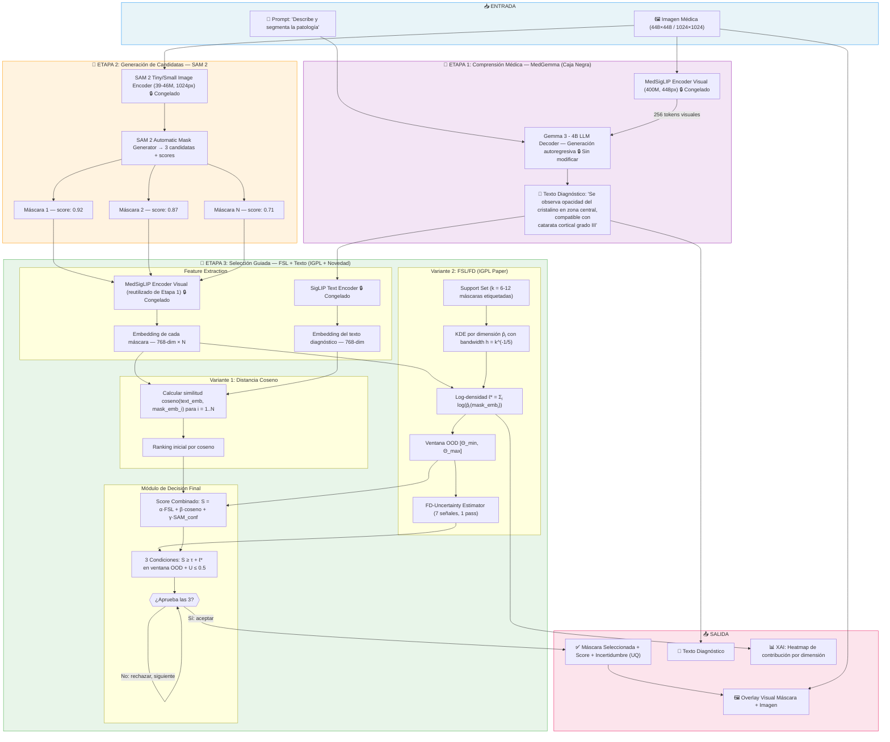
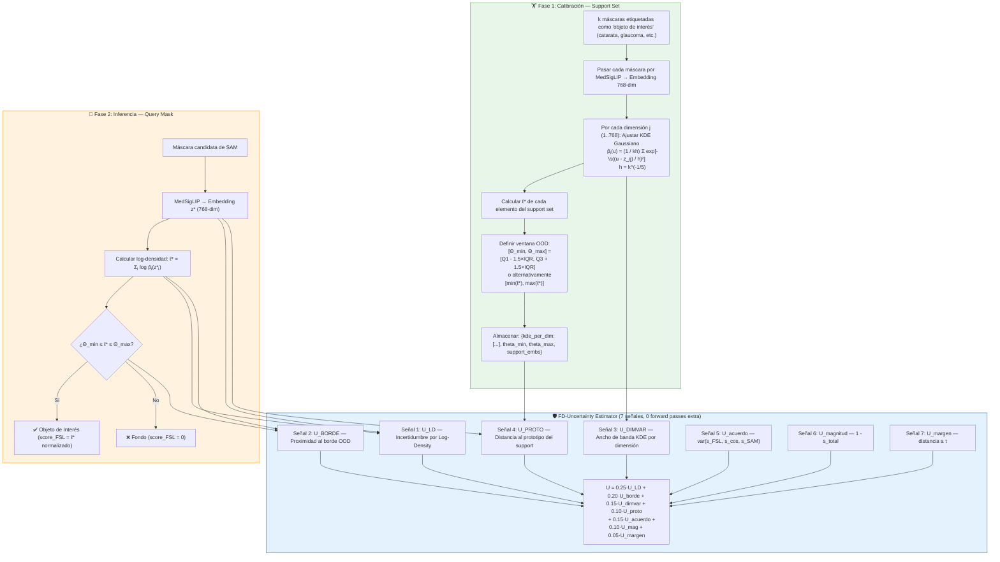
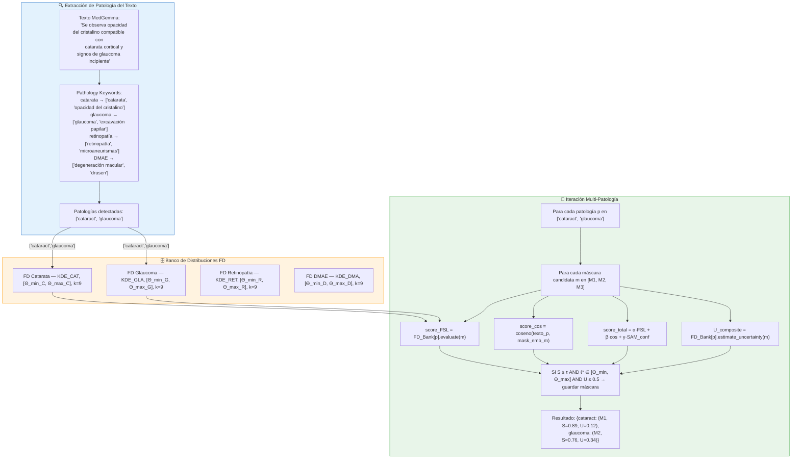
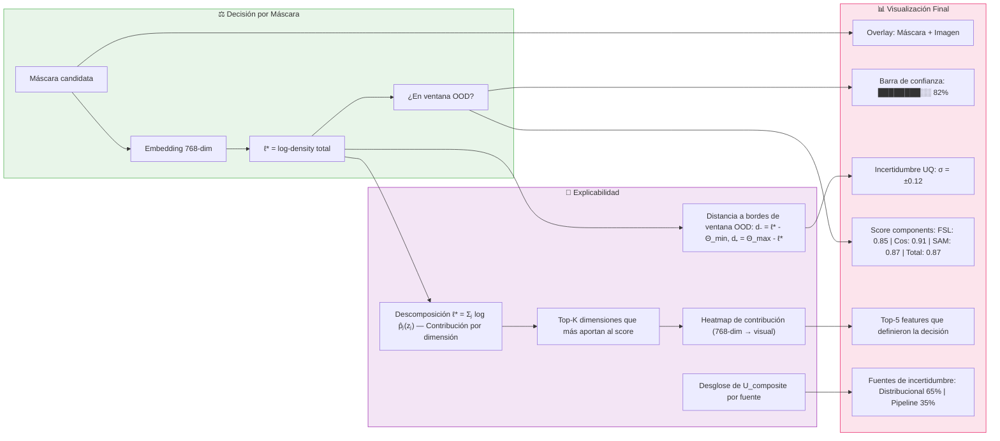
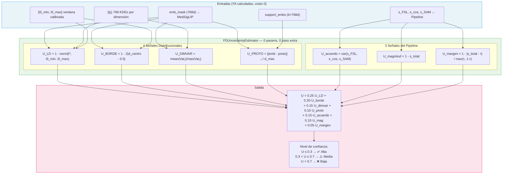

# MedGemma-Seg: Guía Detallada de Implementación

Guía exhaustiva para la implementación del pipeline de segmentación multimodal basado en
MedGemma + SAM 2 + FSL/FD (paper IGPL).

---

## Índice

1. [Visión General del Proyecto](#1-visión-general-del-proyecto)
2. [Arquitectura y Decisiones de Diseño](#2-arquitectura-y-decisiones-de-diseño)
3. [Diagrama de Flujo — Nivel 1: Pipeline Completo](#3-diagrama-de-flujo--nivel-1-pipeline-completo)
4. [Diagrama de Flujo — Nivel 2: Módulo FSL/FD (IGPL)](#4-diagrama-de-flujo--nivel-2-módulo-fslfd-igpl)
5. [Diagrama de Flujo — Nivel 3: Multi-Patología](#5-diagrama-de-flujo--nivel-3-multi-patología)
6. [Diagrama de Flujo — Nivel 4: XAI y Visualización](#6-diagrama-de-flujo--nivel-4-xai-y-visualización)
7. [Diagrama de Flujo — Nivel 5: Flujo de Implementación por Fases](#7-diagrama-de-flujo--nivel-5-flujo-de-implementación-por-fases)
8. [Diagrama de Flujo — Nivel 6: Flujo de Decisión por Imagen](#8-diagrama-de-flujo--nivel-6-flujo-de-decisión-por-imagen)
9. [Fase 1: Pipeline Base — MedGemma + SAM 2 + Coseno](#9-fase-1-pipeline-base--medgemma--sam-2--coseno)
10. [Fase 2: Módulo FSL/FD + FD-Uncertainty Estimator](#10-fase-2-módulo-fslfd--fd-uncertainty-estimator)
11. [Fase 3: Score Compuesto y Decisión Final](#11-fase-3-score-compuesto-y-decisión-final)
12. [Fase 4: Multi-Patología — Banco FD + Text-Guided Routing](#12-fase-4-multi-patología--banco-fd--text-guided-routing)
13. [Fase 5: XAI — Explicabilidad de la Decisión](#13-fase-5-xai--explicabilidad-de-la-decisión)
14. [Fase 6: Pipeline BIP — Framework de Evaluación](#14-fase-6-pipeline-bip--framework-de-evaluación)
15. [Fase 7: AGENTS.md](#15-fase-7-agentsmd)
16. [FD-Uncertainty Estimator: Detalle Completo](#16-fd-uncertainty-estimator-detalle-completo)
17. [Especificaciones Técnicas](#17-especificaciones-técnicas)
18. [Estructura de Directorios](#18-estructura-de-directorios)
19. [Dependencias](#19-dependencias)
20. [Protocolo de Validación FD-UQ vs MC Dropout](#20-protocolo-de-validación-fd-uq-vs-mc-dropout)

---

## 1. Visión General del Proyecto

### Objetivo

Extender **MedGemma** (LLM médico multimodal) con capacidades de segmentación de imágenes.
Actualmente MedGemma solo genera texto diagnóstico. El objetivo es que **además** genere una
máscara de segmentación que muestre exactamente **dónde** está la patología descrita.

### Estrategia

**Pipeline Secuencial (Opción A)** — NO modificar MedGemma internamente. Se usa como caja
negra dentro de un pipeline de 3 etapas:

1. **MedGemma** genera texto diagnóstico
2. **SAM 2** genera máscaras candidatas
3. **FSL/FD** (paper IGPL) selecciona la máscara correcta guiada por el texto

### ¿Por qué Opción A y no Opción B?

| Criterio | Opción A (Elegida) | Opción B (Descartada por ahora) |
|---|---|---|
| Modifica MedGemma | No | Sí (LoRA + token `[SEG]`) |
| Datos necesarios | k=6-12 máscaras por patología | 500+ imágenes con texto+máscara GT |
| GPU mínima | 16 GB | 24 GB+ |
| Tiempo implementación | 3-5 semanas | 6-8 semanas |
| Novedad científica | Alta (combinación novel) | Muy alta si funciona |

### Stack Tecnológico

- **Lenguaje**: Python 3.10+
- **Framework**: PyTorch 2.x
- **Modelos**: HuggingFace `transformers` + `segment-anything` (SAM 2)
- **Visualización**: Matplotlib, PIL

---

## 2. Arquitectura y Decisiones de Diseño

### Las 2 Variantes del Pipeline

Las capturas de pantalla muestran **2 sub-variantes complementarias** del pipeline secuencial.
Ambas comparten la estructura base (MedGemma → texto + SAM → máscaras) y difieren en el
mecanismo de selección:

| Componente | Variante 1 | Variante 2 |
|---|---|---|
| Mecanismo de selección | Distancia Coseno texto↔máscara | FSL/FD (paper IGPL) |
| Costo computacional | Muy bajo | Bajo (KDE precalculado) |
| Precisión esperada | Buena (baseline) | Superior (validado por IGPL) |
| Rol en el pipeline | **Filtro rápido** (ranking inicial) | **Validador riguroso** |

**Decisión**: Ambas variantes se integran **secuencialmente** en un solo pipeline:
coseno para ranking rápido → FSL/FD para validación final.

### Reemplazo de MC Dropout por FD-Uncertainty

En lugar de usar MC Dropout (múltiples forward passes) para estimar incertidumbre, se usa
el propio **KDE del FSL/FD** como estimador de incertidumbre distribucional.

| | MC Dropout | FD-Uncertainty |
|---|---|---|
| Forward passes | 5-10 | **1** |
| Tiempo extra | ~155 ms | **< 0.1 ms** |
| Señales | 1 (varianza) | **7** |
| Tipo de incertidumbre | Epistémica (modelo) | **Distribucional** (ajuste a clase) |
| Calibración | Arbitraria (dropout rate) | **Matemática** (h = k^(-1/5)) |
| Integración con IGPL | No | **Sí** (extiende OOD) |

### Backbone ViT: MedSigLIP (No el híbrido CNN-ViT del paper)

El paper IGPL original usa un backbone híbrido ResNet-50 + ViT-B/16. En esta implementación
se **reutiliza MedSigLIP** como backbone ViT puro:

- Ya está cargado en memoria (viene con MedGemma)
- Preentrenado en imágenes médicas (oftalmología, radiología, etc.)
- 448×448 de resolución (vs 224×224 del ViT-B/16 original)
- Embedding de 768 dimensiones (compatible con el paper)

---

## 3. Diagrama de Flujo — Nivel 1: Pipeline Completo



---

## 4. Diagrama de Flujo — Nivel 2: Módulo FSL/FD (IGPL)



---

## 5. Diagrama de Flujo — Nivel 3: Multi-Patología



---

## 6. Diagrama de Flujo — Nivel 4: XAI y Visualización



---

## 7. Diagrama de Flujo — Nivel 5: Flujo de Implementación por Fases

```mermaid
flowchart TB
    subgraph P1["FASE 1: Pipeline Base — Semanas 1-2"]
        direction LR
        P1A["1.1 Cargar MedGemma via HuggingFace"]
        P1B["1.2 Cargar SAM 2 via segment-anything"]
        P1C["1.3 MedSigLIP como feature extractor"]
        P1D["1.4 SigLIP Text Encoder"]
        P1E["1.5 Módulo Coseno texto↔máscara"]
        P1F["1.6 Integración end-to-end (Variante 1 funcional)"]
    end

    subgraph P2["FASE 2: FSL/FD + FD-UQ — Semanas 2-3"]
        direction LR
        P2A["2.1 KDE por dimensión (h = k^(-1/5))"]
        P2B["2.2 Ventana OOD [Θ_min, Θ_max]"]
        P2C["2.3 Simple-Shot (complementario k≥15)"]
        P2D["2.4 FD-Uncertainty Estimator (7 señales)"]
        P2E["2.5 Validación FD-UQ vs MC Dropout"]
    end

    subgraph P3["FASE 3: Score Compuesto — Semana 3"]
        direction LR
        P3A["3.1 Score S = α·FSL + β·cos + γ·SAM"]
        P3B["3.2 Decisión: S≥τ + OOD + U≤0.5"]
        P3C["3.3 Rechazo iterativo de candidatas"]
    end

    subgraph P4["FASE 4: Multi-Patología — Semanas 3-4"]
        direction LR
        P4A["4.1 Banco FD por patología"]
        P4B["4.2 Parser de texto (keywords)"]
        P4C["4.3 Iterador multi-hallazgo"]
        P4D["4.4 Registro nuevas patologías (0 params)"]
    end

    subgraph P5["FASE 5: XAI + UQ — Semanas 4-5"]
        direction LR
        P5A["5.1 Heatmap dimensión al log-density"]
        P5B["5.2 Visualización borde OOD"]
        P5C["5.3 Desglose U por fuente"]
        P5D["5.4 Overlay final con scores"]
    end

    subgraph P6["FASE 6: BIP Benchmark — Semana 5"]
        direction LR
        P6A["6.1 Grid search k, α"]
        P6B["6.2 Métricas: IoU, Dice, Acc, tiempo, VRAM"]
        P6C["6.3 Comparativa coseno vs FSL vs combinado"]
    end

    P1 --> P2 --> P3 --> P4 --> P5 --> P6

    style P1 fill:#e8f5e9,stroke:#4CAF50
    style P2 fill:#fff3e0,stroke:#FF9800
    style P3 fill:#e3f2fd,stroke:#1565C0
    style P4 fill:#f3e5f5,stroke:#9C27B0
    style P5 fill:#fce4ec,stroke:#E91E63
    style P6 fill:#e8f4f8,stroke:#2196F3
```



---

## 8. Diagrama de Flujo — Nivel 6: Flujo de Decisión por Imagen

```
IMAGEN MÉDICA
    │
    ├─→ MedSigLIP → Gemma 3 → 📝 TEXTO DIAGNÓSTICO ─────────────────────┐
    │                                                    │               │
    ├─→ SAM 2 → M1, M2, M3 (candidatas)                 │               │
    │              │                                      │               │
    │              ├─→ MedSigLIP → emb_m1 (768d) ────────┤               │
    │              ├─→ MedSigLIP → emb_m2 (768d) ────────┤               │
    │              └─→ MedSigLIP → emb_m3 (768d) ────────┤               │
    │                                                    ▼               │
    │                                         SigLIP Text Encoder        │
    │                                         emb_text (768d)             │
    │                                                    │               │
    │              ┌─────────────────────────────────────┤               │
    │              ▼                                     ▼               │
    │    ┌─────────────────┐              ┌─────────────────┐           │
    │    │ VARIANTE 1      │              │ VARIANTE 2      │           │
    │    │ Distancia Coseno│              │ FSL/FD (IGPL)   │           │
    │    │                 │              │                 │           │
    │    │ cos(emb_m, text)│              │ KDE + OOD window│           │
    │    │ → ranking rápido│              │ → ℓ* validation │           │
    │    │ s_cos ∈ [0,1]   │              │ s_FSL ∈ [0,1]   │           │
    │    └────────┬────────┘              └────────┬────────┘           │
    │             │                                │                     │
    │             └────────────┬───────────────────┘                     │
    │                          ▼                                         │
    │              ┌─────────────────────┐                               │
    │              │ FD-UNCERTAINTY      │                               │
    │              │ 7 señales → U ∈ [0,1]                               │
    │              └────────┬────────────┘                               │
    │                       ▼                                            │
    │              ┌─────────────────────┐                               │
    │              │ SCORE COMPUESTO     │                               │
    │              │ S = α·s_FSL         │                               │
    │              │   + β·s_cos         │                               │
    │              │   + γ·s_SAM         │                               │
    │              └────────┬────────────┘                               │
    │                       ▼                                            │
    │              ┌─────────────────────┐                               │
    │              │ DECISIÓN FINAL      │                               │
    │              │ Condición 1: S ≥ τ  │                               │
    │              │ Condición 2: ℓ* ∈   │                               │
    │              │   [Θ_min, Θ_max]    │                               │
    │              │ Condición 3: U ≤ 0.5│                               │
    │              └────────┬────────────┘                               │
    │                       ▼                                            │
    │              ┌─────────────────────┐                               │
    │              │ MULTI-PATOLOGÍA     │                               │
    │              │ ¿Más patologías     │                               │
    │              │ en el texto?        │                               │
    │              │ → Iterar por cada   │                               │
    │              │   patología         │                               │
    │              └────────┬────────────┘                               │
    │                       ▼                                            │
    └───────────→  SALIDA: {patología → (máscara, score, incertidumbre)} │
```

---

## 9. Fase 1: Pipeline Base — MedGemma + SAM 2 + Coseno

**Objetivo**: Tener un pipeline end-to-end funcional con la Variante 1 (Distancia Coseno) como
selector baseline. Sin modificar MedGemma.

**Módulos a crear**:
- `opcion_A/pipeline.py` → Orquestador principal
- `opcion_A/medgemma_loader.py` → Carga de MedGemma
- `opcion_A/sam_loader.py` → Carga de SAM 2
- `opcion_A/feature_extractor.py` → MedSigLIP como extractor
- `opcion_A/cosine_fusion.py` → Módulo de fusión coseno
- `opcion_A/text_encoder.py` → SigLIP text encoder

### Tarea 1.1: Cargar MedGemma 4B

```python
# opcion_A/medgemma_loader.py
from transformers import AutoModel, AutoProcessor

model = AutoModel.from_pretrained(
    "google/medgemma-4b",
    torch_dtype=torch.bfloat16,
    device_map="auto"
)
processor = AutoProcessor.from_pretrained("google/medgemma-4b")
```

- **Input**: Imagen (448×448) + prompt de texto
- **Output**: Texto diagnóstico generado autoregressivamente
- **Restricción**: NO modificar pesos, NO cargar LoRA, solo inferencia

### Tarea 1.2: Cargar SAM 2

```python
# opcion_A/sam_loader.py
from segment_anything import sam_model_registry, SamAutomaticMaskGenerator

sam = sam_model_registry["vit_t"](checkpoint="sam2_tiny.pth")
mask_generator = SamAutomaticMaskGenerator(sam)
masks = mask_generator.generate(image)
# → List[{'segmentation': np.ndarray, 'predicted_iou': float, ...}]
```

- **Input**: Imagen RGB (1024×1024)
- **Output**: ~3-5 máscaras candidatas con puntuación IoU predicha
- **Modelo**: SAM 2 Tiny (38.9M params)
- **Nota IGPL**: El score de SAM NO es confiable en imágenes médicas — por eso necesitamos FSL

### Tarea 1.3: MedSigLIP como Feature Extractor de Máscaras

```python
# opcion_A/feature_extractor.py
def extract_mask_features(image, mask, medsiglip_model, processor):
    # 1. Aplicar máscara a la imagen: masked_img = image × mask
    masked_image = image * mask[:, :, None]

    # 2. Pasar por MedSigLIP (mismo encoder de MedGemma, sin el LLM)
    # NOTA: Extraer solo el encoder visual, no todo MedGemma
    vision_outputs = medsiglip_model.vision_model(masked_image)
    embedding = vision_outputs.pooler_output  # (1, 768)
    # o usar el [CLS] token: vision_outputs.last_hidden_state[:, 0, :]

    return embedding  # (1, 768)
```

- **Input**: Imagen original + máscara binaria (H×W)
- **Output**: Embedding 768-dim por máscara
- **Reutilización**: El encoder visual de MedGemma se usa sin costo extra de VRAM
- **Preprocesamiento**: Redimensionar a 448×448, misma normalización que MedGemma

### Tarea 1.4: SigLIP Text Encoder

```python
# opcion_A/text_encoder.py
def encode_text(text, siglip_model, tokenizer):
    inputs = tokenizer(text, return_tensors="pt", padding=True, truncation=True)
    with torch.no_grad():
        outputs = siglip_model.get_text_features(**inputs)
    return outputs  # (1, 768)
```

- **Input**: Texto diagnóstico de MedGemma
- **Output**: Embedding 768-dim
- **Uso**: Comparar con embeddings de máscaras vía coseno

### Tarea 1.5: Módulo de Fusión por Distancia Coseno

```python
# opcion_A/cosine_fusion.py
def rank_masks_by_cosine(mask_embeddings, text_embedding):
    """
    mask_embeddings: (N, 768) — N máscaras candidatas
    text_embedding:  (1, 768) — embedding del texto diagnóstico

    Returns: ranking ordenado por similitud coseno descendente
    """
    mask_embeddings = F.normalize(mask_embeddings, p=2, dim=-1)
    text_embedding = F.normalize(text_embedding, p=2, dim=-1)

    similarities = (mask_embeddings @ text_embedding.T).squeeze()  # (N,)
    ranking = torch.argsort(similarities, descending=True)

    return {
        'ranking': ranking,
        'scores': similarities,           # s_cos para cada máscara
        'best_idx': ranking[0].item(),
        'best_score': similarities[ranking[0]].item()
    }
```

### Tarea 1.6: Integración End-to-End

```python
# opcion_A/pipeline.py
class MedGemmaSegPipeline:
    def __init__(self):
        self.medgemma = load_medgemma()
        self.sam = load_sam2()
        self.feature_extractor = MaskFeatureExtractor(self.medgemma.vision_encoder)
        self.text_encoder = TextEncoder(self.medgemma.text_encoder)

    def __call__(self, image, prompt="Describe y segmenta la patología"):
        # Etapa 1: Texto diagnóstico
        text = self.medgemma.generate(image, prompt)

        # Etapa 2: Máscaras candidatas
        candidate_masks = self.sam.generate(image)

        # Etapa 3 (Variante 1): Ranking por coseno
        mask_embs = self.feature_extractor(image, candidate_masks)
        text_emb = self.text_encoder(text)

        result = cosine_rank(mask_embs, text_emb)

        return {
            'text': text,
            'masks': candidate_masks,
            'selected_mask': candidate_masks[result['best_idx']],
            'cosine_scores': result['scores'],
            'best_score': result['best_score']
        }
```

---

## 10. Fase 2: Módulo FSL/FD + FD-Uncertainty Estimator

**Objetivo**: Implementar Feature Densities (FD) del paper IGPL con MedSigLIP como ViT
backbone. **Reemplazar MC Dropout por FD-Uncertainty Estimator** (7 señales, 0 forward
passes extra).

**Módulos a crear**:
- `opcion_A/fsl_fd.py` → FSL/FD principal
- `opcion_A/fd_kde.py` → KDE por dimensión
- `opcion_A/ood_window.py` → Ventana OOD
- `opcion_A/simple_shot.py` → Simple-Shot complementario
- `opcion_A/fd_uncertainty.py` → FD-Uncertainty Estimator
- `opcion_A/validation/fd_vs_mcd.py` → Protocolo de validación

### Tarea 2.1: KDE Gaussiano por Dimensión

```python
# opcion_A/fd_kde.py
import torch
import numpy as np

class PerDimensionKDE:
    """
    KDE Gaussiano por dimensión exactamente como en el paper IGPL.

    Para cada dimensión j del embedding (768 dimensiones):
        p̂ⱼ(u) = (1 / kh) × Σᵢ₌₁ᵏ exp[-½ × ((u - z_ij) / h)²]

    donde:
        k = tamaño del support set
        h = k^(-1/5) → bandwidth óptimo de Silverman para Gaussian KDE
    """

    def __init__(self, support_embeddings):
        """
        Args:
            support_embeddings: (k, 768) — embeddings de las máscaras del support set
        """
        self.k = support_embeddings.shape[0]
        self.dim = support_embeddings.shape[1]                     # 768
        self.h = self.k ** (-1.0 / 5.0)                           # bandwidth
        self.support = support_embeddings                          # (k, 768)

    def log_density(self, query_embedding):
        """
        Calcula ℓ* = Σⱼ log p̂ⱼ(z*ⱼ)

        Args:
            query_embedding: (1, 768) o (768,)

        Returns:
            ℓ* (scalar): log-densidad total
            per_dim: (768,) — contribución individual por dimensión
        """
        query = query_embedding.reshape(1, self.dim)              # (1, 768)
        support = self.support                                     # (k, 768)

        # (1, 768) - (k, 768) → (k, 768) diferencias
        diffs = query - support                                    # (k, 768)

        # log p̂ⱼ(z*ⱼ) para cada dimensión j
        # p̂ⱼ = (1/kh) × Σᵢ exp(-½ × ((z*ⱼ - z_ij) / h)²)
        # log p̂ⱼ = -log(kh) + log(Σᵢ exp(-½ × ((z*ⱼ - z_ij) / h)²))

        scaled_diffs = diffs / self.h                              # (k, 768)
        exponents = -0.5 * scaled_diffs ** 2                       # (k, 768)
        log_per_dim = torch.logsumexp(exponents, dim=0)            # (768,)
        log_per_dim = log_per_dim - np.log(self.k * self.h)        # (768,)

        # ℓ* = Σⱼ log p̂ⱼ(z*ⱼ)
        total_log_density = log_per_dim.sum()

        return total_log_density, log_per_dim
```

### Tarea 2.2: Ventana OOD [Θ_min, Θ_max]

```python
# opcion_A/ood_window.py
class OODWindow:
    """
    Calibra la ventana de aceptación [Θ_min, Θ_max] sobre el support set.

    Métodos de calibración (del paper IGPL):
    1. IQR: [Q1 - 1.5×IQR, Q3 + 1.5×IQR]
    2. MinMax: [min(ℓ*), max(ℓ*)]
    """

    def __init__(self, method='iqr'):
        self.method = method

    def calibrate(self, support_log_densities):
        """
        Args:
            support_log_densities: (k,) — ℓ* de cada elemento del support set
        """
        if self.method == 'iqr':
            q1 = torch.quantile(support_log_densities, 0.25)
            q3 = torch.quantile(support_log_densities, 0.75)
            iqr = q3 - q1
            theta_min = q1 - 1.5 * iqr
            theta_max = q3 + 1.5 * iqr
        elif self.method == 'minmax':
            theta_min = support_log_densities.min()
            theta_max = support_log_densities.max()

        self.theta_min = theta_min
        self.theta_max = theta_max

    def is_in_window(self, log_density):
        return self.theta_min <= log_density <= self.theta_max

    def normalize(self, log_density):
        """Normaliza ℓ* a [0, 1] usando la ventana."""
        if log_density < self.theta_min:
            return 0.0
        elif log_density > self.theta_max:
            return 1.0
        return (log_density - self.theta_min) / (self.theta_max - self.theta_min)
```

### Tarea 2.3: Simple-Shot (Complementario)

El paper IGPL muestra que Simple-Shot domina para k ≥ 15. Se implementa como alternativa
a FD para support sets grandes:

```python
# opcion_A/simple_shot.py
def simple_shot_score(query_emb, support_embs, support_labels):
    """
    Simple-Shot: clasifica por similitud coseno al centroide de cada clase.

    Args:
        query_emb: (768,) — embedding de la máscara query
        support_embs: (k, 768) — embeddings del support set
        support_labels: (k,) — 1 = objeto de interés, 0 = fondo

    Returns:
        score ∈ [0, 1]: confianza de que la máscara es 'objeto de interés'
    """
    # Centroide de la clase positiva
    positive_mask = support_labels == 1
    proto_positive = support_embs[positive_mask].mean(dim=0)

    # Centroide de la clase negativa (fondo)
    proto_negative = support_embs[~positive_mask].mean(dim=0)

    # Similitud coseno a cada prototipo
    cos_pos = F.cosine_similarity(query_emb, proto_positive, dim=0)
    cos_neg = F.cosine_similarity(query_emb, proto_negative, dim=0)

    # Softmax sobre las dos clases
    scores = torch.softmax(torch.stack([cos_pos, cos_neg]), dim=0)
    return scores[0].item()  # Score de la clase positiva
```

### Tarea 2.4: FD-Uncertainty Estimator (7 Señales)

Ver sección [16. FD-Uncertainty Estimator: Detalle Completo](#16-fd-uncertainty-estimator-detalle-completo)
para el detalle exhaustivo.

**Resumen de las 7 señales**:

| # | Señal | Fórmula | Peso |
|---|---|---|---|
| 1 | U_LD | `1 - norm(ℓ*, Θ_min, Θ_max)` | 0.25 |
| 2 | U_BORDE | `1 - 2·|d_centro - 0.5|` | 0.20 |
| 3 | U_DIMVAR | `mean(Varⱼ) / max_posible` | 0.15 |
| 4 | U_PROTO | `||emb - proto||₂ / d_max` | 0.10 |
| 5 | U_acuerdo | `var(s_FSL, s_cos, s_SAM)` | 0.15 |
| 6 | U_magnitud | `1 - s_total` | 0.10 |
| 7 | U_margen | `1 - |s_total - τ| / max(τ, 1-τ)` | 0.05 |

**Composición**: `U = 0.25·U_LD + 0.20·U_borde + 0.15·U_dimvar + 0.10·U_proto + 0.15·U_acuerdo + 0.10·U_mag + 0.05·U_margen`

### Tarea 2.5: Validación FD-UQ vs MC Dropout

Ver sección [20. Protocolo de Validación FD-UQ vs MC Dropout](#20-protocolo-de-validación-fd-uq-vs-mc-dropout).

---

## 11. Fase 3: Score Compuesto y Decisión Final

**Objetivo**: Combinar todas las señales en un score único y definir la lógica de decisión final.

**Módulos a crear**:
- `opcion_A/scoring.py` → Score compuesto + decisión

### Tarea 3.1: Score Compuesto

```python
# opcion_A/scoring.py
class CompositeScorer:
    """
    Score compuesto que integra 3 fuentes de señal + incertidumbre.
    """

    def __init__(self, alpha=0.5, beta=0.3, gamma=0.2, tau=0.6):
        self.alpha = alpha      # Peso FSL
        self.beta = beta        # Peso coseno
        self.gamma = gamma      # Peso SAM confidence
        self.tau = tau          # Umbral de decisión

    def compute(self, s_fsl, s_cos, s_sam, uncertainty):
        """
        Args:
            s_fsl:  Score FSL/FD normalizado [0, 1]
            s_cos:  Score coseno texto↔máscara [0, 1]
            s_sam:  Confianza SAM [0, 1]
            uncertainty: U_composite [0, 1]

        Returns:
            decision: dict con todos los scores y decisión final
        """
        s_total = self.alpha * s_fsl + self.beta * s_cos + self.gamma * s_sam

        return {
            's_total': s_total,
            's_fsl': s_fsl,
            's_cos': s_cos,
            's_sam': s_sam,
            'uncertainty': uncertainty,
            'weights': {'alpha': self.alpha, 'beta': self.beta, 'gamma': self.gamma}
        }
```

### Tarea 3.2: Decisión Final con 3 Condiciones

```python
def make_decision(scorer, mask_scores, ood_window, uncertainty):
    """
    3 condiciones para aceptar una máscara:
    1. s_total >= tau → score compuesto supera el umbral
    2. ℓ* en [Θ_min, Θ_max] → log-density dentro de la ventana OOD
    3. U <= 0.5 → incertidumbre aceptable
    """
    s_total = mask_scores['s_total']
    in_ood = ood_window.is_in_window(mask_scores['log_density'])
    low_uncertainty = uncertainty <= 0.5

    accepted = s_total >= scorer.tau and in_ood and low_uncertainty

    return {
        'accepted': accepted,
        'conditions': {
            'score_ok': s_total >= scorer.tau,
            'ood_ok': in_ood,
            'uncertainty_ok': low_uncertainty
        },
        's_total': s_total,
        'uncertainty': uncertainty,
        'rejection_reason': get_rejection_reason(s_total, in_ood, low_uncertainty)
    }
```

### Tarea 3.3: Rechazo Iterativo

```python
def select_best_mask(image, masks, scorer, fd_module, text_emb):
    """
    Evalúa máscaras en orden (por coseno) hasta encontrar una que pase las 3 condiciones.
    Si ninguna pasa, devuelve la mejor por score compuesto con advertencia.
    """
    # Ranking inicial por coseno (Variante 1)
    mask_embs = [extract_features(image, m) for m in masks]
    ranking = cosine_rank(mask_embs, text_emb)

    best_fallback = None
    best_fallback_score = -float('inf')

    for idx in ranking:
        mask = masks[idx]
        emb = mask_embs[idx]

        # FSL/FD (Variante 2)
        log_density, per_dim = fd_module.kde.log_density(emb)
        s_fsl = fd_module.ood_window.normalize(log_density)
        in_ood = fd_module.ood_window.is_in_window(log_density)

        # FD-Uncertainty
        u_composite = fd_module.estimate_uncertainty(emb, s_fsl, cos_scores[idx],
                                                      mask['predicted_iou'])

        # Score compuesto
        s_total = scorer.alpha * s_fsl + scorer.beta * cos_scores[idx] \
                  + scorer.gamma * mask['predicted_iou']

        # Guardar mejor fallback
        if s_total > best_fallback_score:
            best_fallback = mask
            best_fallback_score = s_total
            best_fallback_meta = {'s_total': s_total, 'u': u_composite}

        # Decisión
        if s_total >= scorer.tau and in_ood and u_composite <= 0.5:
            return {
                'mask': mask,
                'accepted': True,
                'score': s_total,
                'uncertainty': u_composite,
                'log_density': log_density,
                'rank': idx
            }

    # Fallback: ninguna máscara pasó las 3 condiciones
    return {
        'mask': best_fallback,
        'accepted': False,
        'warning': 'No mask passed all 3 conditions. Returning best fallback.',
        'score': best_fallback_meta['s_total'],
        'uncertainty': best_fallback_meta['u']
    }
```

---

## 12. Fase 4: Multi-Patología — Banco FD + Text-Guided Routing

**Objetivo**: Soportar múltiples patologías con un banco de distribuciones FD, una por
patología, y un parser de texto que enruta automáticamente.

**Módulos a crear**:
- `opcion_A/multi_pathology.py` → Banco FD + Routing + Iterador
- `opcion_A/pathology_parser.py` → Parser de patología desde texto
- `opcion_A/fd_bank.py` → Banco de distribuciones FD

### Tarea 4.1: Banco FD por Patología

```python
# opcion_A/fd_bank.py
class FDBank:
    """
    Banco de distribuciones FD — una por patología.

    Cada entrada contiene:
    - KDE por dimensión
    - Ventana OOD [Θ_min, Θ_max]
    - FD-Uncertainty estimator
    - Support set embeddings
    """

    def __init__(self):
        self.entries = {}  # {"cataract": {...}, "glaucoma": {...}, ...}

    def register(self, name, support_masks, medsiglip_encoder):
        """
        Registra una nueva patología con k máscaras de ejemplo.
        """
        embeddings = []
        for mask in support_masks:
            emb = medsiglip_encoder.encode(mask)
            embeddings.append(emb)

        embeddings = torch.stack(embeddings)                    # (k, 768)
        kde = PerDimensionKDE(embeddings)
        ood = OODWindow(method='iqr')

        # Calibrar ventana OOD sobre el support set
        support_log_densities = []
        for i in range(len(embeddings)):
            ld, _ = kde.log_density(embeddings[i])
            support_log_densities.append(ld)
        ood.calibrate(torch.tensor(support_log_densities))

        self.entries[name] = {
            'kde': kde,
            'ood': ood,
            'support_embs': embeddings,
            'n_support': len(support_masks)
        }

    def evaluate(self, name, query_emb):
        """Evalúa un query contra la distribución de la patología name."""
        entry = self.entries[name]
        log_density, per_dim = entry['kde'].log_density(query_emb)
        s_fsl = entry['ood'].normalize(log_density)
        in_ood = entry['ood'].is_in_window(log_density)
        return {
            'log_density': log_density,
            's_fsl': s_fsl,
            'in_ood': in_ood,
            'per_dim_contrib': per_dim
        }

    def get_pathologies(self):
        return list(self.entries.keys())
```

### Tarea 4.2: Parser de Patología

```python
# opcion_A/pathology_parser.py
PATHOLOGY_KEYWORDS = {
    "cataract":       ["catarata", "cataract", "opacidad del cristalino",
                       "opacidad cristaliniana"],
    "glaucoma":       ["glaucoma", "presión intraocular", "excavación papilar",
                       "copa óptica"],
    "retinopathy":    ["retinopatía", "retinopathy", "microaneurismas",
                       "exudados", "hemorragias retinianas"],
    "macular_degen":  ["degeneración macular", "DMAE", "drusen",
                       "macular degeneration"],
    "pterygium":      ["pterigión", "pterygium", "carnosidad"],
    "diabetic_ret":   ["retinopatía diabética", "diabetic retinopathy",
                       "RDNP", "RDP"],
}

def parse_pathology(medgemma_text):
    """Detecta TODAS las patologías mencionadas en el texto."""
    text_lower = medgemma_text.lower()
    detected = []
    for pathology, keywords in PATHOLOGY_KEYWORDS.items():
        if any(kw.lower() in text_lower for kw in keywords):
            detected.append(pathology)
    return detected if detected else ["unknown"]
```

### Tarea 4.3: Iterador Multi-Hallazgo

```python
# opcion_A/multi_pathology.py
class MultiPathologyPipeline:
    """
    Para imágenes con múltiples hallazgos, itera cada patología detectada
    y encuentra la mejor máscara para cada una.
    """

    def __init__(self, fd_bank, parser, scorer, feature_extractor):
        self.fd_bank = fd_bank
        self.parser = parser
        self.scorer = scorer
        self.feature_extractor = feature_extractor

    def process(self, image, medgemma_text, candidate_masks, text_emb):
        """
        Returns: List[Dict] — una entrada por patología detectada
        """
        pathologies = self.parser.parse(medgemma_text)
        mask_embs = [self.feature_extractor(image, m) for m in candidate_masks]
        cos_scores = cosine_similarities(mask_embs, text_emb)

        results = []
        for pathology in pathologies:
            if pathology not in self.fd_bank.get_pathologies():
                continue  # Patología sin FD registrada → saltar

            best_result = None
            best_score = -float('inf')

            for i, (mask, emb) in enumerate(zip(candidate_masks, mask_embs)):
                fd_result = self.fd_bank.evaluate(pathology, emb)
                s_fsl = fd_result['s_fsl']

                s_cos = cos_scores[i]
                s_sam = mask['predicted_iou']

                u_comp = self.fd_bank.estimate_uncertainty(pathology, emb,
                                                            s_fsl, s_cos, s_sam)

                s_total = (self.scorer.alpha * s_fsl +
                           self.scorer.beta * s_cos +
                           self.scorer.gamma * s_sam)

                if s_total >= self.scorer.tau and fd_result['in_ood'] and u_comp <= 0.5:
                    if s_total > best_score:
                        best_score = s_total
                        best_result = {
                            'pathology': pathology,
                            'mask': mask,
                            'score': s_total,
                            'uncertainty': u_comp,
                            's_fsl': s_fsl,
                            's_cos': s_cos,
                            's_sam': s_sam
                        }

            if best_result:
                results.append(best_result)

        return results
```

### Tarea 4.4: Registro de Nuevas Patologías

Agregar una nueva patología solo requiere **k máscaras de ejemplo** — 0 parámetros nuevos,
0 reentrenamiento:

```python
fd_bank.register(
    name="cataract",
    support_masks=cataract_support_masks,   # List[np.ndarray], k=6-12
    medsiglip_encoder=feature_extractor
)
```

---

## 13. Fase 5: XAI — Explicabilidad de la Decisión

**Objetivo**: Explicar POR QUÉ el sistema seleccionó (o rechazó) una máscara específica.

**Módulos a crear**:
- `opcion_A/xai.py` → Explicabilidad
- `opcion_A/visualization.py` → Visualización final

### Tarea 5.1: Heatmap de Contribución por Dimensión

```python
def dimension_contribution_heatmap(per_dim_contrib, top_k=10):
    """
    per_dim_contrib: (768,) — contribución individual log p̂ⱼ(z*ⱼ) por dimensión

    Muestra las dimensiones que más contribuyeron al log-density total.
    """
    top_dims = torch.topk(per_dim_contrib, k=top_k)
    bottom_dims = torch.topk(per_dim_contrib, k=top_k, largest=False)

    return {
        'top_contributing': {
            'dims': top_dims.indices.tolist(),
            'values': top_dims.values.tolist()
        },
        'bottom_contributing': {
            'dims': bottom_dims.indices.tolist(),
            'values': bottom_dims.values.tolist()
        },
        'total_log_density': per_dim_contrib.sum().item()
    }
```

### Tarea 5.2: Visualización de Borde OOD

```python
def ood_boundary_visualization(log_density, theta_min, theta_max):
    d_below = log_density - theta_min
    d_above = theta_max - log_density
    return {
        'log_density': log_density,
        'theta_min': theta_min,
        'theta_max': theta_max,
        'distance_below': d_below,
        'distance_above': d_above,
        'centered_score': (log_density - theta_min) / (theta_max - theta_min),
        'interpretation': (
            'well_centered' if 0.25 <= (log_density - theta_min) / (theta_max - theta_min) <= 0.75
            else 'near_boundary'
        )
    }
```

### Tarea 5.3: Desglose de Incertidumbre por Fuente

```python
def uncertainty_breakdown(u_components):
    """
    u_components: dict con las 7 señales individuales
    """
    total = sum(u_components.values())
    distributional = (u_components['U_LD'] + u_components['U_BORDE'] +
                      u_components['U_DIMVAR'] + u_components['U_PROTO'])
    pipeline_scores = (u_components['U_acuerdo'] + u_components['U_magnitud'] +
                       u_components['U_margen'])

    return {
        'total': total,
        'distributional_pct': distributional / total * 100,   # ~65%
        'pipeline_pct': pipeline_scores / total * 100,        # ~35%
        'components': u_components
    }
```

### Tarea 5.4: Overlay Final

```python
def create_overlay(image, mask, decision, xai_info, output_path):
    """
    Genera una visualización final con:
    - Overlay máscara + imagen
    - Barra de confianza
    - Score components
    - Incertidumbre
    - Top features
    """
    # Implementación con matplotlib/PIL
    ...
```

---

## 14. Fase 6: Pipeline BIP — Framework de Evaluación

**Objetivo**: Framework para probar sistemáticamente diferentes configuraciones del pipeline
y evaluar cuál funciona mejor.

**Módulos a crear**:
- `opcion_A/benchmark.py` → Framework de evaluación
- `opcion_A/metrics.py` → Cálculo de métricas

### Tarea 6.1: Grid Search de Hiperparámetros

```python
# opcion_A/benchmark.py
class BIPBenchmark:
    def __init__(self, pipeline, val_dataset):
        self.pipeline = pipeline
        self.val_dataset = val_dataset

    def grid_search(self):
        configs = []

        # Barrido de hiperparámetros
        for k in [3, 6, 9, 12, 30]:                     # Tamaño support set
            for alpha in [0.3, 0.5, 0.7]:               # Peso FSL
                for method in ['fd', 'simple_shot']:     # Método FSL
                    for tau in [0.5, 0.6, 0.7]:          # Umbral de decisión
                        configs.append({
                            'k': k, 'alpha': alpha,
                            'method': method, 'tau': tau,
                            'beta': 1.0 - alpha - 0.2,
                            'gamma': 0.2
                        })

        results = []
        for cfg in configs:
            metrics = self.evaluate_config(cfg)
            results.append({**cfg, **metrics})

        return results
```

### Tarea 6.2: Métricas

```python
# opcion_A/metrics.py
def compute_metrics(pred_mask, gt_mask, pred_time_ms, vram_mb):
    intersection = (pred_mask & gt_mask).sum()
    union = (pred_mask | gt_mask).sum()
    iou = intersection / union if union > 0 else 0

    dice = 2 * intersection / (pred_mask.sum() + gt_mask.sum())

    return {
        'iou': iou,
        'dice': dice,
        'time_ms': pred_time_ms,
        'vram_mb': vram_mb
    }
```

### Tarea 6.3: Comparativa de Configuraciones

Comparar:
- **Cosine-only**: Solo Variante 1 (baseline)
- **FSL-only**: Solo Variante 2 (sin coseno)
- **Combinado**: Ambas variantes + score compuesto
- **Simple-Shot**: Alternativa FSL para k ≥ 15

---

## 15. Fase 7: AGENTS.md

**Objetivo**: Documentar el proyecto para que cualquier modelo futuro (o desarrollador humano)
pueda entender la arquitectura, ejecutar el pipeline, y continuar el desarrollo.

El AGENTS.md incluirá:

- Stack tecnológico y versiones
- Estructura del proyecto
- Comandos de instalación
- Comandos para ejecutar cada fase
- Convenciones de código
- Restricciones de diseño
- Guía de testing
- Referencia a este documento como guía maestra

---

## 16. FD-Uncertainty Estimator: Detalle Completo

### Diagrama del Módulo



### Señal 1: U_LD — Incertidumbre por Log-Density

La señal más importante (peso 0.25). Mide qué tan típico es el query respecto a la
distribución de la clase.

```
ℓ* = Σⱼ log p̂ⱼ(z*ⱼ)

Normalización a [0, 1]:
    si ℓ* < Θ_min  →  U_LD = 1.0      (fuera, totalmente atípico)
    si ℓ* > Θ_max  →  U_LD = 0.0      (sobre-ajustado, posible overfitting)
    si dentro      →  U_LD = 1 - (ℓ* - Θ_min) / (Θ_max - Θ_min)
```

**Interpretación**: ℓ* alto dentro de la ventana = query muy típico de la clase = baja
incertidumbre.

### Señal 2: U_BORDE — Proximidad al Borde OOD

Peso 0.20. Mide qué tan cerca está el query de ser rechazado por la ventana OOD.

```
d_centro = (ℓ* - Θ_min) / (Θ_max - Θ_min)  ∈ [0, 1]
U_BORDE = 1 - 2 × |d_centro - 0.5|          ∈ [0, 1]
```

- U_BORDE = 1 cuando ℓ* toca Θ_min o Θ_max (justo en el borde → máxima incertidumbre)
- U_BORDE = 0 cuando ℓ* está en el centro exacto de la ventana

### Señal 3: U_DIMVAR — Ancho de Banda KDE por Dimensión

Peso 0.15. Dimensiones con KDE ancho → la clase tiene alta variabilidad en esa dimensión →
esa dimensión es poco discriminativa.

```
h = k^(-1/5)              # bandwidth (constante por dimensión en el paper)
Varⱼ = h²                 # varianza del KDE por dimensión

U_DIMVAR = 1 / (1 + exp(-α × mean(|contribuc_j|)))
```

Si el valor absoluto medio de las contribuciones es bajo → las dimensiones no discriminan
bien este query → mayor incertidumbre.

### Señal 4: U_PROTO — Distancia al Prototipo

Peso 0.10. Mide distancia euclidiana al centroide del support set.

```
proto = (1/k) × Σ support_embeddings
d_proto = ||query_emb - proto||₂
U_PROTO = d_proto / (d_proto + d_mediana_support)
```

Query lejos del centroide → atípico para la clase → mayor incertidumbre.

### Señal 5: U_acuerdo — Varianza entre Scores

Peso 0.15. ¿Concuerdan las 3 fuentes de señal (FSL, coseno, SAM)?

```
U_acuerdo = var([s_FSL, s_cos, s_SAM])
U_acuerdo = min(1.0, U_acuerdo / 0.33)    # Normalizar (varianza máxima teórica ~0.33)
```

Si FSL dice 0.9 pero SAM dice 0.3 → desacuerdo → alta incertidumbre.

### Señal 6: U_magnitud — Magnitud del Score Total

Peso 0.10. Score bajo = incertidumbre alta.

```
s_total = 0.5 × s_FSL + 0.3 × s_cos + 0.2 × s_SAM
U_magnitud = 1 - s_total
```

### Señal 7: U_margen — Distancia al Umbral

Peso 0.05. Score cerca del umbral τ = decisión límite.

```
U_margen = 1 - |s_total - τ| / max(τ, 1 - τ)
```

Si score_total = 0.61 y τ = 0.6 → U_margen ≈ 0.98 (muy incierto, justo en el borde).

### Implementación Completa

```python
# opcion_A/fd_uncertainty.py
class FDUncertaintyEstimator:
    """
    Estimador de incertidumbre basado en Feature Densities.
    Usa 7 señales — 0 forward passes extra, 0 parámetros entrenables.
    """

    def __init__(self, alpha=0.5, beta=0.3, gamma=0.2, tau=0.6):
        self.alpha = alpha
        self.beta = beta
        self.gamma = gamma
        self.tau = tau

        # Pesos de las 7 señales
        self.weights = {
            'U_LD': 0.25,
            'U_BORDE': 0.20,
            'U_DIMVAR': 0.15,
            'U_PROTO': 0.10,
            'U_acuerdo': 0.15,
            'U_magnitud': 0.10,
            'U_margen': 0.05
        }

    def estimate(self, query_emb, kde, ood_window, support_embs,
                 s_fsl, s_cos, s_sam):
        """
        Args:
            query_emb: (768,) — embedding de la máscara query
            kde: PerDimensionKDE
            ood_window: OODWindow
            support_embs: (k, 768) — embeddings del support set
            s_fsl, s_cos, s_sam: scores [0, 1]

        Returns:
            u_composite: float [0, 1]
            components: dict con las 7 señales individuales
        """
        log_density, per_dim = kde.log_density(query_emb)

        # Señal 1: U_LD
        u_ld = self._compute_u_ld(log_density, ood_window)

        # Señal 2: U_BORDE
        u_borde = self._compute_u_borde(log_density, ood_window)

        # Señal 3: U_DIMVAR
        u_dimvar = self._compute_u_dimvar(per_dim, kde)

        # Señal 4: U_PROTO
        u_proto = self._compute_u_proto(query_emb, support_embs)

        # Señal 5: U_acuerdo
        u_acuerdo = self._compute_u_acuerdo(s_fsl, s_cos, s_sam)

        # Señal 6: U_magnitud
        s_total = self.alpha * s_fsl + self.beta * s_cos + self.gamma * s_sam
        u_mag = 1 - s_total

        # Señal 7: U_margen
        u_margen = 1 - abs(s_total - self.tau) / max(self.tau, 1 - self.tau)

        components = {
            'U_LD': u_ld, 'U_BORDE': u_borde, 'U_DIMVAR': u_dimvar,
            'U_PROTO': u_proto, 'U_acuerdo': u_acuerdo,
            'U_magnitud': u_mag, 'U_margen': u_margen
        }

        u_composite = sum(self.weights[k] * components[k] for k in components)

        return u_composite, components

    def _compute_u_ld(self, log_density, ood_window):
        if log_density < ood_window.theta_min:
            return 1.0
        elif log_density > ood_window.theta_max:
            return 0.0
        return 1 - (log_density - ood_window.theta_min) / \
               (ood_window.theta_max - ood_window.theta_min)

    def _compute_u_borde(self, log_density, ood_window):
        d_centro = (log_density - ood_window.theta_min) / \
                   (ood_window.theta_max - ood_window.theta_min)
        return 1 - 2 * abs(d_centro - 0.5)

    def _compute_u_dimvar(self, per_dim_contrib, kde):
        """Dimensiones con contribución baja → poca discriminación → incertidumbre."""
        abs_contrib = torch.abs(per_dim_contrib)
        mean_contrib = abs_contrib.mean()
        return 1 / (1 + torch.exp(-5 * (mean_contrib - 0.1)))  # sigmoid

    def _compute_u_proto(self, query_emb, support_embs):
        proto = support_embs.mean(dim=0)
        d_proto = torch.norm(query_emb.squeeze() - proto)
        # Normalizar con distancia mediana del support set
        d_support = torch.norm(support_embs - proto, dim=1)
        d_median = d_support.median()
        return (d_proto / (d_proto + d_median)).item()

    def _compute_u_acuerdo(self, s_fsl, s_cos, s_sam):
        scores = torch.tensor([s_fsl, s_cos, s_sam])
        varianza = scores.var().item()
        return min(1.0, varianza / 0.33)  # Varianza máxima teórica ~0.33
```

---

## 17. Especificaciones Técnicas

### Modelos y VRAM

| Modelo | Parámetros | VRAM (bf16) | Origen |
|---|---|---|---|
| MedGemma 4B (MedSigLIP + Gemma 3) | ~4.4B | ~8 GB | HuggingFace |
| SAM 2 Tiny | 38.9M | ~2 GB | segment-anything |
| **Total** | **~4.44B** | **~10 GB** | — |

### Hiperparámetros

| Parámetro | Valor Default | Descripción |
|---|---|---|
| `k` | 6-12 | Tamaño del support set FSL |
| `h` | `k^(-1/5)` | Bandwidth KDE (Silverman) |
| `α` | 0.5 | Peso score FSL |
| `β` | 0.3 | Peso score coseno |
| `γ` | 0.2 | Peso score SAM |
| `τ` | 0.6 | Umbral de aceptación |
| `Θ_method` | `iqr` | Método ventana OOD (iqr o minmax) |
| `U_threshold` | 0.5 | Umbral de incertidumbre máxima aceptable |

### Dimensiones Clave

| Componente | Dimensión |
|---|---|
| Embedding MedSigLIP (visual) | 768 |
| Embedding SigLIP (texto) | 768 |
| Hidden state Gemma 3 | 3584 |
| Tokens visuales MedSigLIP | 256 |
| Resolución MedSigLIP input | 448×448 |
| Resolución SAM 2 input | 1024×1024 |
| Máscaras candidatas (SAM) | 3 |

---

## 18. Estructura de Directorios

```
MedGemma_Segmentation/
├── AGENTS.md                                    # Guía para modelos futuros
├── implementation_guide_detallado.md             # Este documento
├── implementation_plan.md                        # Plan original (referencia)
├── resumen_paper_igpl_vit.md                     # Resumen paper IGPL
├── propuesta_multi_patologia.md                  # Propuestas multi-patología
├── analysis_lisa_glamm.md                        # Análisis LISA/GLaMM
├── comparativa_lisa_vs_opcionB.md                # Comparativa LISA vs Opción B
│
├── opcion_A/                                    # Pipeline Secuencial (IMPLEMENTACIÓN)
│   ├── __init__.py
│   ├── pipeline.py                              # Orquestador principal
│   ├── medgemma_loader.py                        # Carga MedGemma (HuggingFace)
│   ├── sam_loader.py                             # Carga SAM 2
│   ├── feature_extractor.py                      # MedSigLIP para máscaras
│   ├── text_encoder.py                           # SigLIP text encoder
│   ├── cosine_fusion.py                          # Variante 1: Distancia Coseno
│   ├── fsl_fd.py                                 # FSL/FD principal
│   ├── fd_kde.py                                 # KDE por dimensión
│   ├── ood_window.py                             # Ventana OOD
│   ├── simple_shot.py                            # Simple-Shot complementario
│   ├── fd_uncertainty.py                         # FD-Uncertainty Estimator
│   ├── scoring.py                                # Score compuesto + decisión
│   ├── multi_pathology.py                        # Banco FD + Routing
│   ├── pathology_parser.py                       # Parser de texto
│   ├── fd_bank.py                                # Banco de distribuciones FD
│   ├── xai.py                                    # Explicabilidad
│   ├── visualization.py                          # Overlay y visualización
│   ├── benchmark.py                              # Framework BIP
│   ├── metrics.py                                # IoU, Dice, etc.
│   │
│   └── validation/                               # Protocolos de validación
│       ├── __init__.py
│       └── fd_vs_mcd.py                          # FD-UQ vs MC Dropout
│
├── data/                                         # Datos de ejemplo
│   ├── support_sets/                             # k máscaras por patología
│   │   ├── cataract/
│   │   ├── glaucoma/
│   │   └── ...
│   └── test_images/                              # Imágenes de prueba
│
├── tests/                                        # Tests unitarios
│   ├── test_kde.py
│   ├── test_ood_window.py
│   ├── test_fd_uncertainty.py
│   └── test_pipeline.py
│
├── notebooks/                                    # Notebooks de exploración
│   └── demo.ipynb
│
├── requirements.txt                              # Dependencias
└── README.md                                     # Descripción general
```

---

## 19. Dependencias

```
# requirements.txt
torch>=2.1.0
torchvision>=0.16.0
transformers>=4.40.0
accelerate>=0.28.0
bitsandbytes>=0.41.0          # (opcional) cuantización 4-bit
segment-anything>=1.0
Pillow>=10.0.0
numpy>=1.24.0
matplotlib>=3.7.0
scipy>=1.10.0                  # Para KDE alternativo
tqdm>=4.65.0
einops>=0.7.0
```

---

## 20. Protocolo de Validación FD-UQ vs MC Dropout

Para confirmar que FD-Uncertainty produce resultados comparables o superiores a MC Dropout:

```python
# opcion_A/validation/fd_vs_mcd.py

class UncertaintyValidator:
    """
    Compara FD-UQ con MC Dropout y valida calibración.
    """

    def __init__(self, medsiglip_encoder, support_set, val_set):
        self.encoder = medsiglip_encoder
        self.support_set = support_set
        self.val_set = val_set

    def validate(self, fd_estimator, n_mcd_passes=10):
        """
        Evalúa sobre un val_set con ground truth.
        Cada muestra: (image, mask_candidate, is_correct: bool)
        """
        results = []

        for image, mask, is_correct in self.val_set:
            emb = self.encoder.encode(image, mask)

            # FD-Uncertainty (1 pass)
            u_fd, _ = fd_estimator.estimate(emb, ...)

            # MC Dropout (N=10 passes)
            u_mcd = self._mc_dropout_uncertainty(image, mask, n=n_mcd_passes)

            results.append({
                'u_fd': u_fd,
                'u_mcd': u_mcd,
                'correct': is_correct
            })

        # Métrica 1: Correlación Pearson
        u_fd_vals = [r['u_fd'] for r in results]
        u_mcd_vals = [r['u_mcd'] for r in results]
        pearson_r, p_value = pearsonr(u_fd_vals, u_mcd_vals)

        print(f"Correlación Pearson FD-UQ vs MCD: r={pearson_r:.3f}, p={p_value:.4f}")
        print(f"  Objetivo: r > 0.7 → ✅  |  r < 0.5 → ❌ Revisar")

        # Métrica 2: Calibración por deciles
        sorted_results = sorted(results, key=lambda r: r['u_fd'])
        n = len(sorted_results)
        decile_size = n // 10

        deciles_data = []
        for d in range(10):
            start = d * decile_size
            end = start + decile_size if d < 9 else n
            subset = sorted_results[start:end]

            mean_u_fd = np.mean([r['u_fd'] for r in subset])
            error_rate = 1 - np.mean([r['correct'] for r in subset])

            deciles_data.append({
                'decile': d + 1,
                'mean_uncertainty': mean_u_fd,
                'error_rate': error_rate
            })

            print(f"  Decil {d+1}: U={mean_u_fd:.2f}, Error={error_rate:.2%}")
        print(f"  Debe ser monótona creciente: más U → más error")

        # Métrica 3: Expected Calibration Error (ECE)
        ece = self._compute_ece(deciles_data)
        print(f"ECE: {ece:.4f}  →  Objetivo: < 0.10")

        return {
            'pearson_r': pearson_r,
            'pearson_p': p_value,
            'ece': ece,
            'deciles': deciles_data
        }

    def _mc_dropout_uncertainty(self, image, mask, n=10):
        """MC Dropout: N forward passes con dropout activo."""
        log_densities = []
        self.encoder.train()  # Activar dropout

        for _ in range(n):
            with torch.no_grad():
                emb = self.encoder.encode(image, mask)
                ld, _ = kde.log_density(emb)
                log_densities.append(ld.item())

        self.encoder.eval()  # Restaurar modo eval
        return np.std(log_densities)

    def _compute_ece(self, deciles_data):
        """Expected Calibration Error."""
        ece = 0.0
        for d in deciles_data:
            ece += abs(d['error_rate'] - d['mean_uncertainty'])
        return ece / len(deciles_data)
```

### Criterios de Aceptación

| Métrica | Objetivo | Interpretación |
|---|---|---|
| Pearson r | > 0.7 | FD-UQ correlaciona bien con MCD |
| Curva de calibración | Monótona creciente | Más U → más error real |
| ECE | < 0.10 | Buena calibración de incertidumbre |
| Speedup | > 100× | FD-UQ significativamente más rápido |

---

## Resumen de Tareas (40 en total)

| Fase | # Tareas | Prioridad | Semana |
|---|---|---|---|
| Fase 1: Pipeline Base | 6 | Alta | 1-2 |
| Fase 2: FSL/FD + FD-UQ | 12 | Alta | 2-3 |
| Fase 3: Score Compuesto | 3 | Alta | 3 |
| Fase 4: Multi-Patología | 4 | Alta | 3-4 |
| Fase 5: XAI | 4 | Media | 4-5 |
| Fase 6: BIP Benchmark | 3 | Media | 5 |
| Fase 7: AGENTS.md | 1 | Media | Transversal |
| **Total** | **40** | — | **5 semanas** |

---

> [!IMPORTANT]
> **Principios rectores de la implementación**:
> 1. **NO modificar MedGemma** — se usa como caja negra (inferencia pura)
> 2. **Seguir IGPL al pie de la letra** — KDE con `h = k^(-1/5)`, ventana OOD [Θ_min, Θ_max]
> 3. **Reutilizar MedSigLIP** como ViT backbone (ya cargado, preentrenado en datos médicos)
> 4. **FD-UQ reemplaza MC Dropout** — 7 señales, 0 forward passes extra, ~1500× más rápido
> 5. **0 parámetros nuevos** en FSL/FD y FD-UQ — solo operaciones sobre embeddings existentes
> 6. **Nuevas patologías = solo k máscaras** — sin reentrenamiento, sin parámetros nuevos
