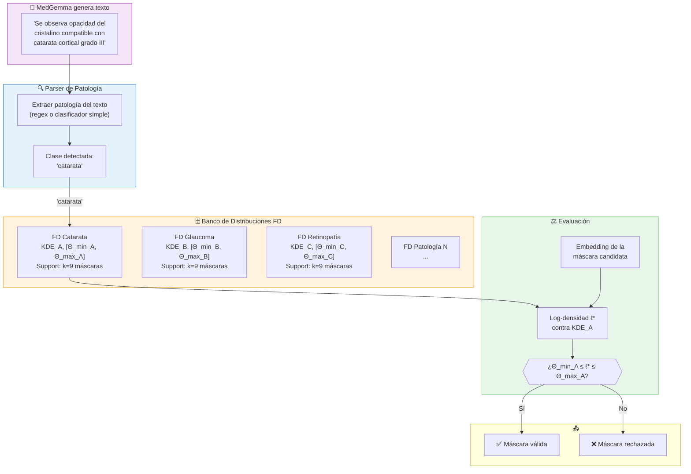
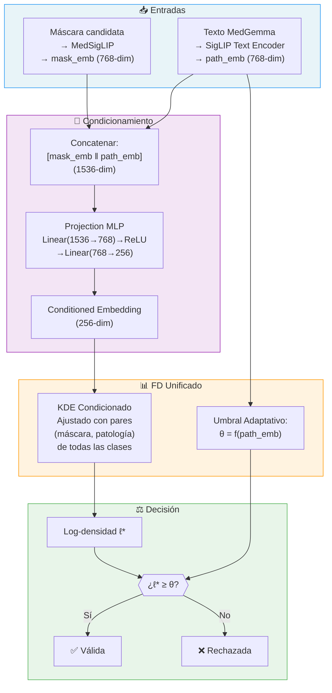
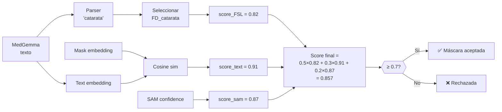

# Solución al Problema Multi-Patología en FSL/FD

## El Problema

En el paper IGPL, el módulo FD mantiene **una sola distribución KDE** con **una sola ventana OOD** [Θ_min, Θ_max]. Esto funciona para clasificación binaria (catarata vs. fondo), pero falla cuando hay múltiples patologías:

```
Patología A (catarata):     [Θ_min_A, Θ_max_A] = [-120, -85]
Patología B (glaucoma):     [Θ_min_B, Θ_max_B] = [-95, -60]
Patología C (retinopatía):  [Θ_min_C, Θ_max_C] = [-140, -100]
```

Si llega una máscara de glaucoma y la comparamos contra el umbral de catarata → **falla**. Necesitamos saber **qué patología buscar** antes de aplicar el umbral correcto.

---

## Pieza Clave: MedGemma Ya Resuelve la Mitad

MedGemma genera texto como:

> *"Se observa **opacidad del cristalino** en zona central, compatible con **catarata cortical** grado III"*

Ese texto **ya contiene la clasificación**. La pregunta es: ¿cómo conectamos esa clasificación con el umbral FD correcto?

---

## Propuesta 1: Text-Guided Routing (Simple y Directa)

### Idea

Mantener un **banco de distribuciones FD**, una por cada patología. MedGemma clasifica vía texto → se enruta al banco FD correspondiente.

### Diagrama



### Implementación

```python
class MultiPathologyFDBank:
    def __init__(self):
        # Un FD module por patología, cada uno con su KDE y umbrales
        self.fd_modules = {}  # {"cataract": FDModule, "glaucoma": FDModule, ...}
    
    def register_pathology(self, name, support_masks, vit_encoder):
        """Registrar nueva patología con k máscaras de ejemplo."""
        embeddings = vit_encoder.encode(support_masks)  # (k, 768)
        kde = fit_per_dimension_kde(embeddings)          # KDE por dimensión
        theta_min, theta_max = compute_ood_window(kde, embeddings)
        self.fd_modules[name] = {"kde": kde, "theta": (theta_min, theta_max)}
    
    def validate_mask(self, pathology_name, mask_embedding):
        """Validar máscara contra la distribución de la patología detectada."""
        module = self.fd_modules[pathology_name]
        log_density = compute_log_density(module["kde"], mask_embedding)
        theta_min, theta_max = module["theta"]
        return theta_min <= log_density <= theta_max


# Parser simple para extraer patología del texto de MedGemma
PATHOLOGY_KEYWORDS = {
    "cataract":       ["catarata", "opacidad del cristalino", "cataract"],
    "glaucoma":       ["glaucoma", "presión intraocular", "excavación papilar"],
    "retinopathy":    ["retinopatía", "microaneurismas", "exudados"],
    "macular_degen":  ["degeneración macular", "drusen", "DMAE"],
}

def parse_pathology(medgemma_text):
    """Detectar patología mencionada en el texto de MedGemma."""
    text_lower = medgemma_text.lower()
    for pathology, keywords in PATHOLOGY_KEYWORDS.items():
        if any(kw.lower() in text_lower for kw in keywords):
            return pathology
    return "unknown"
```

### Ventajas y Limitaciones

| ✅ Ventajas | ❌ Limitaciones |
|---|---|
| Muy simple de implementar | Necesita k máscaras de support por **cada** patología |
| Cada patología tiene su propia distribución optimizada | El parser de texto puede fallar si MedGemma usa terminología inesperada |
| Fácil de agregar nuevas patologías (solo agregar support set) | No maneja patologías co-ocurrentes (ej. catarata + glaucoma en la misma imagen) |
| Sin parámetros entrenables nuevos | Las distribuciones son independientes (no comparten información) |

---

## Propuesta 2: Pathology-Conditioned Feature Density (Intermedia)

### Idea

En lugar de bancos separados, crear un **espacio de embedding unificado** donde el KDE se **condiciona** sobre un vector de patología extraído del texto de MedGemma. Un solo modelo que recibe `(mask_embedding, pathology_embedding)` y decide si la máscara es válida para esa patología.

### Diagrama



### Cómo Funciona

1. **Mask Embedding**: La máscara candidata (imagen × máscara) se pasa por MedSigLIP → vector de 768 dims.
2. **Pathology Embedding**: El texto de MedGemma se pasa por el encoder de texto de SigLIP → vector de 768 dims que captura *qué patología* se describe.
3. **Conditioned Embedding**: Se concatenan ambos vectores (1536-dim) y se proyectan a 256-dim con un MLP pequeño. Este embedding representa "esta máscara para esta patología".
4. **KDE Condicionado**: Se ajusta **un solo KDE** usando pares (máscara_correcta, patología) de **todas** las clases juntas en el espacio condicionado.
5. **Umbral Adaptativo**: En lugar de un umbral fijo, se aprende una función `θ = f(path_emb)` que produce el umbral correcto para cada patología. Puede ser tan simple como:

```python
# Umbral adaptativo: pequeña red que predice θ dado el pathology embedding
class AdaptiveThreshold(nn.Module):
    def __init__(self, emb_dim=768):
        super().__init__()
        self.net = nn.Sequential(
            nn.Linear(emb_dim, 128),
            nn.ReLU(),
            nn.Linear(128, 2),  # predice [θ_min, θ_max]
        )
    
    def forward(self, pathology_embedding):
        return self.net(pathology_embedding)  # → (θ_min, θ_max)
```

### Ventajas y Limitaciones

| ✅ Ventajas | ❌ Limitaciones |
|---|---|
| Un solo modelo para todas las patologías | Necesita entrenamiento del MLP de proyección y el AdaptiveThreshold |
| Comparte información entre clases (transferencia) | Requiere más datos: pares (máscara, patología) de múltiples clases |
| Maneja patologías co-ocurrentes (puede evaluar cada una) | MLP añade ~600K parámetros entrenables |
| El umbral se adapta automáticamente a cada clase | Más complejo de implementar y debuggear |
| Generaliza mejor a patologías nuevas (few-shot transfer) | |

---

## Propuesta 3: Clasificación Explícita + Score Compuesto (Pragmática)

### Idea

La más simple para el caso multi-patología real: usar MedGemma como clasificador, y hacer que el score final combine **tres señales**:

```
score_final = α × score_FSL_class + β × cosine(mask_emb, text_emb) + γ × sam_confidence
```

Donde `score_FSL_class` viene del banco FD de la patología detectada (Propuesta 1), `cosine(mask_emb, text_emb)` viene de la similitud máscara↔texto vía SigLIP, y `sam_confidence` es la confianza original de SAM.

### Flujo de Decisión



### Caso Multi-Patología (Múltiples hallazgos)

Cuando MedGemma dice: *"Se observa **catarata cortical** y signos de **glaucoma** con excavación papilar..."*

```python
def process_multi_pathology(medgemma_text, candidate_masks, fd_bank):
    # 1. Extraer TODAS las patologías mencionadas
    pathologies = parse_all_pathologies(medgemma_text)  # ["cataract", "glaucoma"]
    
    results = []
    for pathology in pathologies:
        # 2. Para cada patología, evaluar TODAS las máscaras candidatas
        best_mask = None
        best_score = -inf
        
        for mask in candidate_masks:
            mask_emb = medsig_encode(mask)
            
            # Score FSL contra el banco de esa patología
            s_fsl = fd_bank.score(pathology, mask_emb)
            
            # Score de similitud texto↔máscara
            text_emb = siglip_text_encode(f"segmentation mask of {pathology}")
            s_text = cosine_similarity(mask_emb, text_emb)
            
            # Score compuesto
            score = 0.5 * s_fsl + 0.3 * s_text + 0.2 * mask.sam_confidence
            
            if score > best_score:
                best_score = score
                best_mask = mask
        
        results.append({"pathology": pathology, "mask": best_mask, "score": best_score})
    
    return results  # Una máscara por cada patología detectada
```

**Resultado**: La imagen genera **múltiples máscaras**, cada una asociada a una patología diferente — similar a cómo GLaMM ancla frases a máscaras con `<p>`/`</p>`.

---

## Comparativa de las 3 Propuestas

| Criterio | Propuesta 1 (Routing) | Propuesta 2 (Condicionada) | Propuesta 3 (Score Compuesto) |
|---|---|---|---|
| **Complejidad** | Baja | Media-Alta | Media |
| **Datos necesarios** | k masks × N patologías | Más datos mixtos | k masks × N patologías |
| **Parámetros nuevos** | 0 | ~600K (MLP + threshold) | 0 |
| **Multi-patología** | ❌ Evalúa una a la vez | ✅ Natural | ✅ Itera por patología |
| **Generalización a nueva patología** | Solo con nuevo support set | Puede generalizar (transfer) | Solo con nuevo support set |
| **Riesgo de error** | Parser de texto falla | MLP mal entrenado | Pesos α,β,γ mal calibrados |
| **Implementación** | ~2 días | ~1-2 semanas | ~3-4 días |

---

## Recomendación

> [!IMPORTANT]
> **Empezar con Propuesta 1 (Routing) + elementos de Propuesta 3 (Score Compuesto)**:
> 1. Crear banco FD con una distribución por patología.
> 2. Usar el parser de texto de MedGemma para enrutar.
> 3. Combinar score FSL + similitud texto-máscara + confianza SAM como score final.
> 4. Para multi-patología, iterar: evaluar cada patología contra todas las máscaras.
>
> Esto da un sistema funcional rápido. Si después se necesita mejor generalización, evolucionar hacia Propuesta 2 con el MLP condicionado.

## Open Questions

> [!NOTE]
> 1. ¿Cuántas patologías diferentes necesita cubrir el sistema inicialmente? (solo cataratas, o también glaucoma, retinopatía, etc.)
> 2. ¿Es realista que aparezcan **múltiples patologías en la misma imagen**? Esto define si necesitamos el flujo multi-patología.
> 3. ¿Tiene acceso a máscaras de ejemplo para cada patología? ¿Cuántas aproximadamente?
