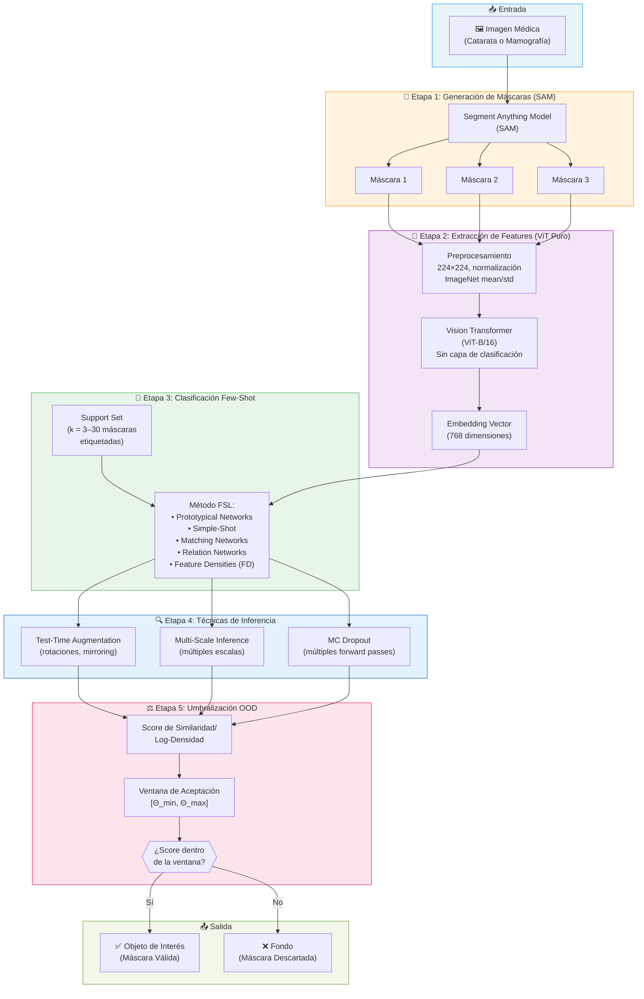
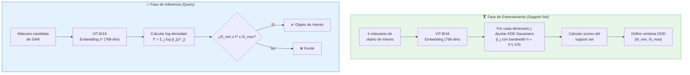

# Resumen del Paper IGPL — Propuesta Modificada con ViT Puro

## Datos del Paper Original

- **Título**: *Few-Shot Learning for SAM Mask Selection in Eye and Breast Imaging*
- **Revista**: Logic Journal of the IGPL, 2025
- **Autores**: Nivar Anwer, Miguel Abreu-Cardenas, Iván García-Aguilar, Samir Cabrera Tabash, et al.
- **Instituciones**: Georgia Tech, Universidad de Málaga, TEC Costa Rica, De Montfort University

---

## 1. Resumen Global de la Propuesta Original

### ¿Cuál es el problema?

El modelo **SAM** (Segment Anything Model) genera **múltiples máscaras candidatas** para cada imagen, y su mecanismo de confianza interna no siempre selecciona la máscara correcta — especialmente en imágenes médicas especializadas como mamografías y fotografías de cataratas. La máscara con mayor confianza frecuentemente sobre-segmenta o falla completamente.

### ¿Qué propone el paper?

Un **pipeline de selección de máscaras** que determina automáticamente cuál de las máscaras generadas por SAM corresponde al "objeto de interés" (catarata o tejido mamario) y cuáles son "fondo". El pipeline tiene 3 etapas clave:

1. **Backbone Híbrido CNN–Transformer** para extraer features robustos de cada máscara candidata.
2. **Algoritmos de Few-Shot Learning (FSL)** para clasificar máscaras con muy pocos ejemplos etiquetados.
3. **Umbralización OOD** (Out-of-Distribution) para decidir si una máscara pertenece al objeto de interés o al fondo.

### Contribución Novel: Feature Densities (FD)

Introduce **Feature Densities para FSL**: en lugar de entrenar un clasificador completo, modela la distribución de embeddings de las máscaras de objeto de interés usando **KDE** (Kernel Density Estimation — una técnica que estima la función de probabilidad de los datos) por cada dimensión del embedding, y calibra un intervalo de aceptación para distinguir el objeto objetivo.

---

## 2. Diagrama de la Propuesta (Modificada con ViT Puro)

> [!IMPORTANT]
> En la propuesta original se usa un **Hybrid CNN–ViT** (ResNet-50 + ViT-B/16 fusionados). En esta versión modificada, se **reemplaza el backbone híbrido por un ViT puro** (Vision Transformer), eliminando la rama convolucional completamente.



---

## 3. Explicación Detallada de Cada Componente

### Etapa 1: Generación de Máscaras con SAM

**SAM** recibe la imagen médica y genera automáticamente **hasta 3 máscaras candidatas** por imagen, cada una con un puntaje de confianza.

- **Problema clave**: La máscara con mayor confianza de SAM **no siempre es la correcta** (ver Figuras 1 y 2 del paper). En cataratas, SAM puede sobre-segmentar incluyendo fondo; en mamografías puede delinear tejido incorrectamente.
- **Datasets utilizados**:
  - **Cataratas**: Imágenes retinales de 640×640 píxeles con distintos grados de severidad.
  - **Mamografías**: 46 mamogramas de 2560×3328 (reducidos a 300×300), generando 130 máscaras candidatas.

### Etapa 2: Extracción de Features — ViT Puro (MODIFICACIÓN)

> [!WARNING]
> **Cambio respecto al paper original**: Se elimina completamente la rama ResNet-50 del backbone híbrido. Solo se usa **ViT-B/16** como extractor de features.

#### Paper Original (Hybrid CNN–ViT):
```
Imagen → ResNet-50 (features locales) ──┐
                                         ├── Fusion Network → Embedding (768-dim)
Imagen → ViT-B/16 (features globales) ──┘
```

#### Propuesta Modificada (ViT Puro):
```
Imagen → ViT-B/16 (features globales) → Embedding (768-dim)
```

**¿Cómo funciona el ViT-B/16?**

1. La imagen se redimensiona a **224×224** píxeles.
2. Se divide en **patches** de 16×16 (dando 14×14 = 196 patches).
3. Cada patch se proyecta linealmente a un vector de 768 dimensiones.
4. Se agrega un **[CLS] token** al inicio de la secuencia.
5. Se suman **positional embeddings** aprendidos.
6. La secuencia pasa por **12 capas de Transformer** (Multi-Head Self-Attention + Feed-Forward).
7. Se extrae el **[CLS] token de la última capa** como el embedding final de 768 dimensiones.
8. Se **elimina la cabeza de clasificación** (solo se necesita el embedding).

**Implicaciones del cambio a ViT puro**:

| Aspecto | Hybrid (Original) | ViT Puro (Modificado) |
|---|---|---|
| Features locales | ✅ ResNet-50 los captura | ❌ Depende del self-attention para capturar localidad |
| Features globales | ✅ ViT los captura | ✅ ViT los captura nativamente |
| Dimensión del embedding | 768 (tras fusión) | 768 (directo del [CLS] token) |
| Complejidad del modelo | Mayor (2 backbones + fusion) | Menor (1 solo backbone) |
| Parámetros | ~111M (ResNet-50: ~25M + ViT-B: ~86M) | ~86M (solo ViT-B) |
| Velocidad de inferencia | Más lenta (2 forward passes) | Más rápida (1 forward pass) |

### Etapa 3: Clasificación Few-Shot

La tarea se formula como **clasificación binaria**: cada máscara candidata se clasifica como "objeto de interés" (IoU con ground truth ≥ umbral τ) o "fondo".

Se prueban **5 métodos FSL** sobre el embedding del ViT:

#### a) Prototypical Networks (ProtoNets)
- Calcula un **prototipo** (vector promedio) por cada clase usando los embeddings del support set.
- Clasifica un query calculando la distancia euclidiana a cada prototipo.
- Asigna la clase del prototipo más cercano.

#### b) Simple-Shot
- Similar a ProtoNets pero usa **similitud coseno** en lugar de distancia euclidiana.
- Más simple y robusto: no requiere entrenamiento episódico.
- **Mejor rendimiento en mamografías** (80.2% a k=33).

#### c) Matching Networks
- Usa un **mecanismo tipo atención** para comparar el query con cada ejemplo del support set.
- Pondera los embeddings del support por su similitud con el query.
- **Peor rendimiento**: cae drásticamente con embeddings de alta dimensión.

#### d) Relation Networks
- Aprende un **módulo de relación** (red neuronal) que cuantifica la similaridad entre query y support.
- Rendimiento intermedio, pero decae con support sets grandes.

#### e) Feature Densities (FD) — Método Propuesto
- **No entrena un clasificador**. En su lugar:
  1. Extrae embeddings del support set con el ViT.
  2. Por cada dimensión *j* del embedding (768 dimensiones), ajusta un **KDE Gaussiano**:
     
     ```
     p̂_j(u) = (1/kh) Σ exp[-½((u - z_ij)/h)²],   h = k^(-1/5)
     ```
  3. En inferencia, calcula el **log-densidad** total del query: `ℓ* = Σ_j log p̂_j(z*_j)`
  4. Clasifica según: si `Θ_min ≤ ℓ* ≤ Θ_max` → objeto de interés; sino → fondo.
- **Mejor rendimiento para k ≤ 12** (75.3% a k=6 en cataratas).

### Etapa 4: Técnicas de Inferencia Robusta

Para estabilizar las predicciones, se aplican 3 técnicas complementarias:

- **TTA (Test-Time Augmentation)**: Se aplican transformaciones (rotaciones, espejos) a la imagen query, se clasifica cada versión, y se promedian las probabilidades.
- **Multi-Scale Inference**: Se alimenta la imagen a distintas escalas y se agregan las predicciones.
- **MC Dropout**: Se mantiene el Dropout activo en inferencia, se realizan múltiples forward passes, y se combinan para una predicción con estimación de incertidumbre.

### Etapa 5: Umbralización OOD

- Se calculan los scores de similaridad/densidad para todos los ejemplos del support set.
- Se define una **ventana de aceptación [Θ_min, Θ_max]** basada en la distribución de esos scores.
- Los queries cuyo score cae **dentro** de la ventana se aceptan como objeto de interés.
- Los queries **fuera** se descartan como fondo.
- Esta ventana **se adapta automáticamente** al tamaño y distribución del support set.

---

## 4. Resultados Clave del Paper Original

### Cataratas

| k (support) | Simple-Shot | Feature Densities | Prototypical | Matching | Relation |
|---|---|---|---|---|---|
| 3 | **0.683** | 0.657 | 0.658 | 0.414 | 0.476 |
| 6 | 0.720 | **0.753** | 0.653 | 0.410 | 0.470 |
| 9 | 0.735 | **0.740** | 0.440 | 0.416 | 0.418 |
| 12 | 0.725 | **0.750** | 0.452 | 0.400 | 0.426 |
| 30 | **0.676** | 0.386 | 0.142 | 0.389 | 0.246 |

- **FD domina para k ≤ 12**; Simple-Shot toma la delantera para k ≥ 15.
- Wilcoxon signed-rank test entre FD y Simple-Shot: **p = 0.23** (sin diferencia significativa).

### Mamografías

- **Simple-Shot**: Mejor accuracy promedio (μ = 75.4%, σ = 3.4%), pico de **80.2% a k=33**.
- **Prototypical**: Competitivo, sin diferencia significativa vs Simple-Shot (p = 0.18).
- **Matching y Relation**: Claramente inferiores (p < 0.01).

---

## 5. Impacto Esperado del Cambio a ViT Puro

> [!NOTE]
> **Análisis teórico** del impacto de eliminar ResNet-50 y usar solo ViT-B/16.

### Ventajas esperadas

1. **Menor complejidad**: Un solo backbone reduce memoria, tiempo de inferencia, y puntos de fallo.
2. **Consistencia de representación**: El embedding proviene de un solo espacio latente, evitando posibles desalineaciones en la fusión CNN–ViT.
3. **Self-attention global**: ViT captura relaciones globales de forma nativa, lo cual es valioso en imágenes médicas donde el contexto global (ej. forma completa del ojo o del seno) es crucial.

### Riesgos potenciales

1. **Pérdida de features locales de alta frecuencia**: ResNet-50 captura bordes, texturas y patrones locales finos. ViT puede perder detalles a nivel de bordes de la catarata o microcalcificaciones en mamografías.
2. **Menor rendimiento en k pequeño**: El paper reporta que el híbrido supera a backbones individuales. Con ViT solo, los embeddings podrían ser menos discriminativos para FSL con pocos ejemplos.
3. **Data efficiency**: ViT generalmente necesita más datos de preentrenamiento para ser competitivo vs CNNs. Con ImageNet pretraining debería funcionar, pero el margen podría ser menor.

### Mitigación recomendada

- Usar **ViT-B/16 preentrenado en ImageNet-21k** (no solo ImageNet-1k) para embeddings más ricos.
- Considerar **DINOv2** como ViT preentrenado, ya que sus representaciones son más robustas para tareas downstream sin fine-tuning.
- Mantener TTA + Multi-Scale + MC Dropout para compensar la posible pérdida de features locales.

---

## 6. Diagrama del Flujo de Feature Densities con ViT Puro



---

## 7. Conclusiones del Paper y Adaptación

El paper concluye que:

1. **La combinación SAM + backbone robusto + FSL** convierte propuestas crudas multi-máscara en segmentaciones precisas, incluso con solo un puñado de máscaras verificadas.
2. **FD y Simple-Shot son complementarios**: FD excele con pocos ejemplos (k ≤ 12), Simple-Shot mejora con más datos (k ≥ 15).
3. La rama CNN aporta resolución local y la rama Transformer inyecta contexto global.

**Con la modificación a ViT puro**, se pierde la dualidad local/global del backbone, pero se gana simplicidad y velocidad. Se recomienda compensar con ViTs preentrenados de alta calidad (DINOv2, ImageNet-21k) y mantener las técnicas de robustificación de inferencia (TTA, Multi-Scale, MC Dropout).
